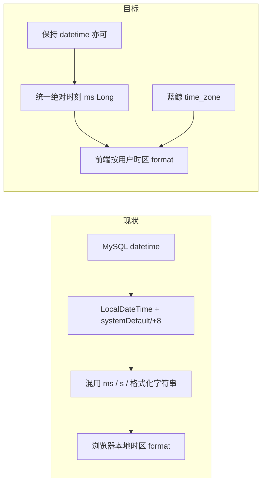

# bk-ci 时区支持：现状评估与方案建议

## 结论（直接回答你的四个问题）

### 1. 后端全面存 Unix 时间戳能否实现目标？

**不能单靠「全面改存 Unix」实现，也不建议把改存储当作主路径。**

当前事实：
- **DB 主流是 `datetime` / `timestamp`**，DAO/jOOQ 用 `LocalDateTime`，读出后再转成 `Long`（常见于 Process/Build）
- 对外 API **并未统一 Unix**：毫秒 Long、秒级 Long、`yyyy-MM-dd HH:mm:ss` 字符串、`@JsonFormat` 的 `LocalDateTime`、ISO `LocalDateTime`（无 offset）并存
- 时区语义几乎全是 `ZoneId.systemDefault()`，另有硬编码 `UTC+8`；蓝鲸用户 `time_zone` 仅在租户用户反序列化里出现，**未透传、未消费**

「用户当地时间展示」依赖的是：**绝对时刻（Instant）正确传到客户端 + 按用户 IANA 时区格式化**。存储用 DATETIME 还是 BIGINT Unix，只要读写时不丢绝对时刻，都能支持；全面改 DDL 成本极高、对展示目标收益低。

### 2. 需要调整的逻辑类别

| 类别 | 问题 | 调整方向 |
|------|------|----------|
| 出站格式化字符串 | Store / Environment / Project / Quality 等把时间写成 `yyyy-MM-dd HH:mm:ss` | 改为毫秒 Unix（与 Process 对齐） |
| `@JsonFormat` / 裸 `LocalDateTime` | Metrics 等序列化为无时区字符串 | 改为 epoch 或带 offset 的 Instant |
| 秒 vs 毫秒 | Process/Log 偏 ms；Auth/Notify/部分 IAM 偏 s；前端靠调用方 `*1000` | **统一毫秒** |
| `DateTimeUtil` 不一致 | [`DateTimeUtil.kt`](src/backend/ci/core/common/common-api/src/main/kotlin/com/tencent/devops/common/api/util/DateTimeUtil.kt) 中 `timestampmilli()` 用 systemDefault，`convertLocalDateTimeToTimestamp` 写死 `+8` | 统一基于 Instant/UTC，去掉业务展示用 `toDateTime` |
| 查询入参「自然日」 | Metrics 等 `yyyy-MM-dd` 无 zone | 约定日历时区（用户时区或明确传 zone）再换算为 UTC 区间 |
| 通知/文案嵌入时间 | 质量拦截、RTX 等服务端已拼好人读时间 | 通知类可后端按用户时区格式化；页面展示仍走 Unix |
| 用户时区接入 | [`TenantAuthDeptServiceImpl.UserInfo.time_zone`](src/backend/ci/core/auth/biz-auth/src/main/kotlin/com/tencent/devops/auth/service/TenantAuthDeptServiceImpl.kt) 未使用；前端 User 模型无 timezone | Auth/用户接口透传 `time_zone`，前端写入全局格式化工具 |

### 3. 是否存在未返回 Unix 给前端的逻辑？

**大量存在。** 大致三类：

**A. 已接近理想（毫秒 Long）——优先保持**
- 流水线/构建：`BuildHistory.startTime/endTime/queueTime` 等
- 日志：`LogLine.timestamp`（`currentTimeMillis`）

**B. Unix 但单位是秒——需统一或明确约定**
- Auth 管理用户时间、部分 Notify、IAM `expiredAt`
- 前端多处手动 `* 1000`（environment agent、quality、ticket、codelib、Audit 等）

**C. 人类可读字符串 / LocalDateTime——阻碍用户时区（主要债务）**
- Store：`Atom.createTime/updateTime: String` 等
- Environment：`NodeWithPermission.createTime: String?`；Agent `lastBuildTime` 服务端 `DateTimeFormatter` 格式化
- Metrics：`@JsonFormat(pattern = "yyyy-MM-dd HH:mm:ss")` 的 `LocalDateTime`
- Quality：拦截历史等 `format(...)`；注意还有 `hh`（12 小时制）风险
- Project Activity / 部分 Repository / Auth 文案：`DateTimeUtil.toDateTime(...)`
- 前端还能直接吃 ISO 字符串（repo `createdDate`、stream moment、turbo 原样展示）

前端现状：各子应用复制的 `convertTime` / `timeFormatter`（dayjs/moment/`new Date`），**按浏览器本地时区**展示，**无显式 IANA 时区、无蓝鲸 time_zone**。若后端继续返回无 zone 的 `"2024-01-01 12:00:00"`，前端无法可靠还原绝对时刻再换算。

### 4. 推荐：前端换算，还是后端返回已算好的字符串？

**推荐：后端统一返回 Unix 毫秒（绝对时刻）；前端（含统一时间工具）按蓝鲸用户时区格式化展示。**

| 维度 | 前端按时区换算（推荐） | 后端返回当地时间字符串 |
|------|------------------------|------------------------|
| 正确性 | Instant 不丢；换时区不需重拉接口 | 字符串已绑死某时区；缓存/多端易错 |
| 与现状契合 | Process/Build/Log 已是 ms；前端已有 format 习惯 | 需每个接口读用户时区并格式化 |
| 多端 | OpenAPI、导出、移动端可复用同一 epoch | 每个消费方要么再解析假本地时间，要么各要一份 |
| 查询筛选 | DatePicker → ms/UTC 区间清晰 | 「自然日」仍需约定时区，后端更重 |
| 例外 | — | **仅通知邮件/企业微信文案**适合后端按用户时区拼字符串 |

不推荐「后端全面改存 Unix BIGINT」作为一期目标；推荐 **API 契约统一为毫秒时间戳 + 淘汰对人端的格式化时间字段**。

---

## 建议的目标架构（一期）

1. **契约**：所有「时刻」类字段对外为 `Long` 毫秒 Unix；文档与 Swagger 标明单位。
2. **存储**：可继续 `datetime`；读写经 Instant，禁止用 systemDefault/+8 做业务展示语义。
3. **用户时区**：从蓝鲸用户管理取 `time_zone`，经 Auth/用户信息接口给前端；前端统一 `formatByUserTz(ms)`（dayjs-timezone 或 Intl）。
4. **收敛债务**：优先改 C 类字符串出站（Store、Environment、Metrics、Quality、Project）；再统一 B 类秒→毫秒。
5. **例外**：推送/邮件中的时间可由后端用用户时区格式化；页面列表/详情一律前端格式化。

---

## 一期改造优先级（评估后的实施顺序）

1. 用户时区透传（Auth/`time_zone` → 前端全局）
2. 前端公共时间工具（统一 ms + IANA zone；替换各应用散落的 `convertTime`）
3. 出站字符串字段改为 ms（按模块：Environment / Store / Metrics / Quality / Project）
4. 修正 `DateTimeUtil` 的 +8 vs systemDefault；禁止新代码 `toDateTime` 对人端 VO
5. 查询「按日」接口明确时区语义（用户时区日界 → UTC 区间）

存储层 DDL 全面改 Unix **不纳入一期**。
