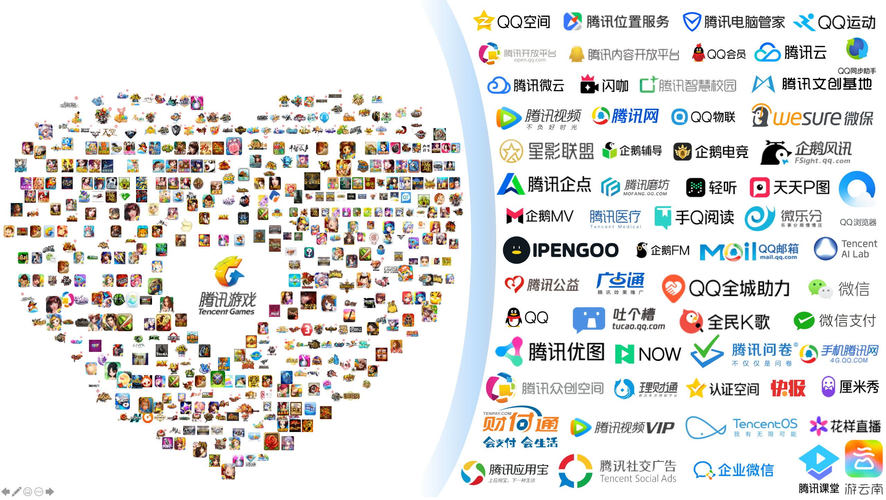

---
  

> **重要提示**: `master` 分支在开发过程中可能处于 *不稳定或者不可用状态* 。
请通过[releases](https://github.com/tencent/bk-ci/releases) 而非 `master` 去获取稳定的二进制文件。

蓝鲸持续集成平台（代号蓝盾）是一个开源的持续集成和持续交付系统，目前服务于腾讯10000+开发人员，现已成为公司指定的CI平台。另外，她也获得行业至今为止唯一一个4级认证的DevOps标准。

## What to Use BK-CI for and When to Use It
使用蓝盾屏蔽掉所有研发流程中的繁琐环节，让你聚焦于编码。蓝盾通常被用于：
- 工程编译
- 静态代码检查
- 运行测试用例，及时发现BUG
- 部署与发布

## About
蓝盾提供了流水线、代码库、凭证管理、环境管理、研发商店5大核心服务，多重组合，满足企业不同场景的需求：
- **流水线**：将团队现有的研发流程以可视化方式呈现出来，编译、测试、部署，一条流水线搞定
- **代码库**：将企业内已有的代码托管服务关联至蓝盾
- **凭证管理**：为代码库、流水线等服务提供不同类型的凭据、证书管理功能
- **环境管理**：可以将企业内部的开发编译机托管至蓝盾
- **研发商店**：由流水线插件和流水线模板组成，插件用于对接企业内部的各种第三方服务，模板助力企业内部的研发流程规范化

## Overview

- [架构设计](docs/overview/architecture.md)
- [代码目录](docs/overview/code_framework.md)
- [设计理念](docs/overview/design.md)

## Features
| 特性 | 介绍  |
| ------ | ------  |
| **持续集成和持续交付** | 	由于框架的可扩展性，蓝盾既可以用作简单的CI场景，也可以成为企业内所有项目的持续交付中心	  |
| **所见即所得**  | 蓝盾提供了灵活的可视化编排流水线，动动指尖，将研发流程描述与此  |
| **架构平行可扩展** | 灵活的架构设计可以随意横向扩容，满足企业大规模使用  |
| **分布式** | 蓝盾可以便捷的管控多台构建机，助你更快的跨多平台构建、测试和部署	  |
| **流水线插件**  |  蓝盾拥有完善的插件开发体系，其具备了低门槛、灵活可扩展等特性  |
| **流水线模板** |  流水线模板将是企业内部推行研发规范的一大助力  |

## Getting started
- [v1版Docker体验镜像下载](https://cloud.docker.com/u/blueking/repository/docker/blueking/bk-ci)
- [下载与编译](docs/overview/source_compile.md)
- [一分钟安装部署](docs/overview/installation.md)

## Support
1. 阅读 [wiki](https://github.com/Tencent/bk-ci/wiki) 或者寻求帮助
2. 常见 [FAQ](https://github.com/Tencent/bk-ci/wiki/FAQ)
3. 了解蓝鲸整体的社区生态请加入蓝鲸社区版交流QQ群，：495299374

# They are using BK-CI
> 

## BK Community
- [BCS](https://github.com/Tencent/bk-bcs)：蓝鲸容器管理平台是以容器技术为基础，为微服务业务提供编排管理的基础服务平台。
- [CMDB](https://github.com/Tencent/bk-cmdb)：蓝鲸配置平台（蓝鲸CMDB）是一个面向资产及应用的企业级配置管理平台。
- [PaaS](https://github.com/Tencent/bk-PaaS)：蓝鲸PaaS平台是一个开放式的开发平台，让开发者可以方便快捷地创建、开发、部署和管理SaaS应用。
- [SOPS](https://github.com/Tencent/bk-sops)：标准运维（SOPS）是通过可视化的图形界面进行任务流程编排和执行的系统，是蓝鲸体系中一款轻量级的调度编排类SaaS产品。

## Contributing to BK-CI
- 关于 bk-ci 分支管理、issue 以及 pr 规范，请阅读 [Contributing](CONTRIBUTING.md)
- [腾讯开源激励计划](https://opensource.tencent.com/contribution) 鼓励开发者的参与和贡献，期待你的加入

## License
BK-CI 是基于 MIT 协议， 详细请参考 [LICENSE](LICENSE)
