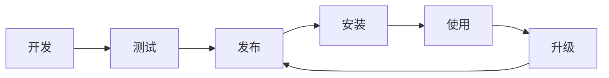

# 插件开发与使用指南

## 目录

1. [插件概述](#插件概述)
2. [插件使用指南](#插件使用指南)
3. [插件开发入门](#插件开发入门)
4. [task.json 配置详解](#taskjson-配置详解)
5. [多语言开发指南](#多语言开发指南)
6. [插件 SDK 使用](#插件-sdk-使用)
7. [插件发布流程](#插件发布流程)
8. [插件调试与测试](#插件调试与测试)
9. [最佳实践](#最佳实践)
10. [常见问题解答](#常见问题解答)

---

## 插件概述

### 什么是插件

蓝盾插件是流水线中的执行单元，用于完成特定的构建任务。插件具有以下特点：

- **标准化接口**：通过 task.json 定义输入输出
- **多语言支持**：支持 Java、Python、NodeJS、Golang 等
- **可复用性**：一次开发，多处使用
- **扩展性强**：支持自定义业务逻辑

### 插件分类

| 分类 | 说明 | 示例 |
|------|------|------|
| **代码检出** | 从代码仓库拉取代码 | Git、SVN |
| **构建编译** | 编译打包应用 | Maven、Gradle、NPM |
| **测试验证** | 执行测试用例 | 单元测试、集成测试 |
| **质量检查** | 代码质量分析 | SonarQube、ESLint |
| **部署发布** | 应用部署上线 | Docker、K8s |
| **通知告警** | 消息通知 | 企业微信、邮件 |

### 插件生命周期



---

## 插件使用指南

### 安装插件

#### 从研发商店安装

1. **进入研发商店**
   ```
   蓝盾首页 → 研发商店 → 流水线插件
   ```

2. **搜索插件**
   - 按名称搜索
   - 按分类筛选
   - 查看插件详情

3. **安装到项目**
   ```
   插件详情页 → 安装 → 选择项目 → 确认安装
   ```

#### 插件权限管理

| 角色 | 权限 |
|------|------|
| **项目管理员** | 安装/卸载插件 |
| **项目成员** | 使用已安装插件 |
| **插件开发者** | 发布/更新插件 |

### 在流水线中使用插件

#### 添加插件到流水线

1. **编辑流水线**
   ```
   流水线 → 编辑 → 添加插件
   ```

2. **配置插件参数**
   - 必填参数：红色标记
   - 可选参数：根据需要配置
   - 高级选项：展开查看更多配置

3. **插件执行顺序**
   ```
   Stage 1: 代码检出
   ├── Git 插件
   └── 代码扫描插件
   
   Stage 2: 构建打包
   ├── Maven 构建
   └── Docker 镜像构建
   
   Stage 3: 部署发布
   └── K8s 部署插件
   ```

#### 插件参数配置

```yaml
# 示例：Maven 构建插件配置
input:
  goals: "clean package"           # 构建目标
  mavenVersion: "3.6.3"          # Maven 版本
  jdkVersion: "1.8"               # JDK 版本
  profiles: "prod"                # 激活的 Profile
  skipTests: false                # 是否跳过测试
  
output:
  artifactPath: "target/*.jar"    # 构件路径
  testReport: "target/test-reports" # 测试报告
```

### 插件变量使用

#### 获取插件输出

```bash
# 使用上一个插件的输出变量
echo "构件路径: ${插件别名.artifactPath}"
echo "测试结果: ${插件别名.testResult}"
```

#### 传递变量给下游插件

```json
{
  "output": {
    "buildVersion": {
      "type": "string",
      "value": "1.0.0-${BUILD_NUMBER}"
    }
  }
}
```

---

## 插件开发入门

### 开发环境准备

#### 必备工具

| 工具 | 用途 | 安装方式 |
|------|------|----------|
| **Git** | 代码版本控制 | 官网下载 |
| **IDE** | 代码编辑器 | IntelliJ IDEA / VS Code |
| **语言环境** | 运行时环境 | JDK / Python / Node.js |

#### 插件工作台

1. **登录插件工作台**
   ```
   https://devops.woa.com/console/store/workList/atom
   ```

2. **创建新插件**
   - 插件标识：英文字母，创建后不可修改
   - 插件名称：中文名称，可修改
   - 开发语言：Java/Python/NodeJS/Golang
   - 调试项目：用于测试插件

### 插件项目结构

#### 标准目录结构

```
my-plugin/
├── task.json              # 插件配置文件
├── README.md              # 插件说明文档
├── src/                   # 源代码目录
│   └── main/
│       ├── java/          # Java 源码
│       └── resources/     # 资源文件
├── pom.xml               # Maven 配置 (Java)
├── requirements.txt      # Python 依赖 (Python)
├── package.json         # NPM 配置 (NodeJS)
└── go.mod              # Go 模块 (Golang)
```

#### 核心文件说明

| 文件 | 必需 | 说明 |
|------|------|------|
| `task.json` | ✅ | 插件配置文件，定义输入输出 |
| `README.md` | ✅ | 插件使用说明 |
| 源代码文件 | ✅ | 插件业务逻辑实现 |
| 依赖配置文件 | ⚠️ | 根据语言类型选择 |

---

## task.json 配置详解

### 基本结构

```json
{
  "atomCode": "myPlugin",           // 插件唯一标识
  "defaultLocaleLanguage": "zh_CN", // 默认语言
  "execution": {                    // 执行配置
    "language": "java",
    "target": "java -jar app.jar",
    "demands": ["echo 'setup'"]
  },
  "inputGroups": [                  // 输入分组
    {
      "name": "基础配置",
      "isExpanded": true
    }
  ],
  "input": {                        // 输入参数定义
    // 参数配置
  },
  "output": {                       // 输出参数定义
    // 输出配置
  }
}
```

### 执行配置 (execution)

#### 基础配置

```json
{
  "execution": {
    "language": "java",                    // 开发语言
    "target": "java -jar app.jar",        // 启动命令
    "demands": [                           // 前置命令
      "echo 'Installing dependencies'",
      "chmod +x setup.sh && ./setup.sh"
    ],
    "runtimeVersion": "1.8",              // 运行时版本
    "finishKillFlag": true                // 结束后是否杀进程
  }
}
```

#### 多平台支持

```json
{
  "execution": {
    "language": "golang",
    "os": [
      {
        "osName": "linux",
        "osArch": "amd64",
        "target": "./app-linux",
        "defaultFlag": true
      },
      {
        "osName": "windows",
        "osArch": "amd64", 
        "target": "./app-windows.exe",
        "defaultFlag": false
      },
      {
        "osName": "darwin",
        "osArch": "amd64",
        "target": "./app-darwin",
        "defaultFlag": false
      }
    ]
  }
}
```

### 输入参数配置 (input)

#### 基础输入类型

```json
{
  "input": {
    "textInput": {
      "label": "文本输入",
      "type": "vuex-input",
      "default": "默认值",
      "placeholder": "请输入文本",
      "desc": "参数说明",
      "required": true,
      "disabled": false,
      "hidden": false,
      "isSensitive": false
    },
    
    "selectInput": {
      "label": "下拉选择",
      "type": "selector",
      "options": [
        {"id": "option1", "name": "选项1"},
        {"id": "option2", "name": "选项2"}
      ],
      "default": "option1",
      "required": true
    },
    
    "booleanInput": {
      "label": "布尔选择",
      "type": "atom-checkbox",
      "default": false,
      "text": "启用此功能"
    },
    
    "multiSelect": {
      "label": "多选框",
      "type": "checkbox",
      "options": [
        {"id": "check1", "name": "选项1"},
        {"id": "check2", "name": "选项2"}
      ],
      "default": ["check1"]
    }
  }
}
```

#### 高级输入类型

```json
{
  "input": {
    "codeRepository": {
      "label": "代码库",
      "type": "code-lib",
      "scmType": ["CODE_GIT", "CODE_SVN"],
      "required": true
    },
    
    "artifactPath": {
      "label": "构件路径",
      "type": "artifactory",
      "required": false
    },
    
    "credential": {
      "label": "凭证",
      "type": "credential",
      "credentialTypes": ["PASSWORD", "SSH_PRIVATEKEY"],
      "required": false
    },
    
    "dynamicParameter": {
      "label": "动态参数",
      "type": "parameter",
      "paramType": "string",
      "required": false
    }
  }
}
```

#### 参数分组

```json
{
  "inputGroups": [
    {
      "name": "基础配置",
      "isExpanded": true
    },
    {
      "name": "高级配置", 
      "isExpanded": false
    }
  ],
  "input": {
    "basicParam": {
      "label": "基础参数",
      "type": "vuex-input",
      "groupName": "基础配置"
    },
    "advancedParam": {
      "label": "高级参数",
      "type": "vuex-input", 
      "groupName": "高级配置"
    }
  }
}
```

### 输出参数配置 (output)

```json
{
  "output": {
    "stringOutput": {
      "description": "字符串输出",
      "type": "string",
      "isSensitive": false
    },
    
    "artifactOutput": {
      "description": "构件输出",
      "type": "artifact",
      "isSensitive": false
    },
    
    "reportOutput": {
      "description": "报告输出",
      "type": "report",
      "isSensitive": false
    }
  }
}
```

### 内置变量

在 task.json 中可以使用以下内置变量：

| 变量名 | 说明 |
|--------|------|
| `{projectId}` | 项目英文ID |
| `{pipelineId}` | 流水线ID |
| `{buildId}` | 构建ID |

使用示例：
```json
{
  "input": {
    "projectPath": {
      "default": "/data/{projectId}/workspace"
    }
  }
}
```

---

## 多语言开发指南

### Java 插件开发

#### 项目配置

**pom.xml 配置**
```xml
<?xml version="1.0" encoding="UTF-8"?>
<project xmlns="http://maven.apache.org/POM/4.0.0">
    <modelVersion>4.0.0</modelVersion>
    
    <parent>
        <groupId>com.tencent.bk.devops.atom</groupId>
        <artifactId>sdk-dependencies</artifactId>
        <version>1.0.0</version>
    </parent>
    
    <artifactId>my-plugin</artifactId>
    <version>1.0.0</version>
    
    <properties>
        <sdk.version>1.1.58</sdk.version>
        <java.version>1.8</java.version>
        <maven.compiler.source>${java.version}</maven.compiler.source>
        <maven.compiler.target>${java.version}</maven.compiler.target>
        <project.build.sourceEncoding>UTF-8</project.build.sourceEncoding>
    </properties>
    
    <dependencies>
        <dependency>
            <groupId>com.tencent.bk.devops.atom</groupId>
            <artifactId>java-atom-sdk</artifactId>
            <version>${sdk.version}</version>
        </dependency>
    </dependencies>
    
    <build>
        <finalName>${project.name}</finalName>
        <plugins>
            <plugin>
                <groupId>org.apache.maven.plugins</groupId>
                <artifactId>maven-assembly-plugin</artifactId>
            </plugin>
        </plugins>
    </build>
</project>
```

#### 参数类定义

```java
@Data
@EqualsAndHashCode(callSuper = true)
public class MyPluginParam extends AtomBaseParam {
    /**
     * 输入参数定义
     */
    private String inputText;      // 文本输入
    private String selectOption;   // 下拉选择
    private Boolean enableFlag;    // 布尔值
    private String credentialId;   // 凭证ID
}
```

#### 插件主类实现

```java
@AtomService(paramClass = MyPluginParam.class)
public class MyPluginAtom implements TaskAtom<MyPluginParam> {
    
    private static final Logger logger = LoggerFactory.getLogger(MyPluginAtom.class);
    
    @Override
    public void execute(AtomContext<MyPluginParam> atomContext) {
        // 1. 获取输入参数
        MyPluginParam param = atomContext.getParam();
        AtomResult result = atomContext.getResult();
        
        // 2. 参数校验
        if (!validateParams(param, result)) {
            return;
        }
        
        // 3. 业务逻辑处理
        try {
            logger.groupStart("执行插件逻辑");
            
            String processResult = processBusinessLogic(param);
            
            logger.info("处理完成，结果: {}", processResult);
            logger.groupEnd("执行插件逻辑");
            
            // 4. 设置输出参数
            Map<String, DataField> data = result.getData();
            data.put("processResult", new StringData(processResult));
            
        } catch (Exception e) {
            logger.error("插件执行失败", e);
            result.setErrorInfo(
                Status.error,
                ErrorCodeConstants.PLUGIN_ERROR,
                ErrorType.PLUGIN,
                new String[]{e.getMessage()}
            );
        }
    }
    
    private boolean validateParams(MyPluginParam param, AtomResult result) {
        if (StringUtils.isBlank(param.getInputText())) {
            result.setErrorInfo(
                Status.failure,
                ErrorCodeConstants.PARAMETER_IS_NULL,
                ErrorType.USER,
                new String[]{"输入文本不能为空"}
            );
            return false;
        }
        return true;
    }
    
    private String processBusinessLogic(MyPluginParam param) {
        // 实现具体的业务逻辑
        return "处理结果";
    }
}
```

#### SPI 配置

创建文件：`src/main/resources/META-INF/services/com.tencent.bk.devops.atom.spi.TaskAtom`

内容：
```
com.example.MyPluginAtom
```

### Python 插件开发

#### 项目配置

**requirements.txt**
```txt
python_atom_sdk>=1.2.19
requests==2.20.1
requests-toolbelt==0.9.1
```

**setup.py**
```python
from setuptools import setup, find_packages

setup(
    name="my-plugin",
    version="1.0.0",
    packages=find_packages(),
    entry_points={
        'console_scripts': [
            'my-plugin=my_plugin.main:main'
        ]
    },
    install_requires=[
        'python_atom_sdk>=1.2.19',
        'requests==2.20.1'
    ]
)
```

#### 插件主逻辑

```python
# -*- coding: utf-8 -*-

import python_atom_sdk
import sys
import traceback

def main():
    """
    插件主入口
    """
    try:
        python_atom_sdk.log.info("开始执行插件")
        
        # 1. 获取输入参数
        input_params = python_atom_sdk.get_input()
        input_text = input_params.get("inputText", "")
        select_option = input_params.get("selectOption", "")
        enable_flag = input_params.get("enableFlag", "false") == "true"
        
        # 2. 参数校验
        if not input_text:
            raise ValueError("输入文本不能为空")
        
        # 3. 业务逻辑处理
        python_atom_sdk.log.info("处理输入: {}".format(input_text))
        
        result = process_business_logic(input_text, select_option, enable_flag)
        
        # 4. 设置输出
        output_data = {
            "status": python_atom_sdk.status.SUCCESS,
            "message": "执行成功",
            "type": python_atom_sdk.output_template_type.DEFAULT,
            "data": {
                "processResult": {
                    "type": python_atom_sdk.output_field_type.STRING,
                    "value": result
                }
            }
        }
        
        python_atom_sdk.set_output(output_data)
        python_atom_sdk.log.info("插件执行完成")
        
    except Exception as e:
        python_atom_sdk.log.error("插件执行失败: {}".format(str(e)))
        python_atom_sdk.log.error(traceback.format_exc())
        
        output_data = {
            "status": python_atom_sdk.status.FAILURE,
            "message": str(e),
            "errorCode": "PLUGIN_ERROR",
            "errorType": python_atom_sdk.output_error_type.PLUGIN
        }
        
        python_atom_sdk.set_output(output_data)
        sys.exit(1)

def process_business_logic(input_text, select_option, enable_flag):
    """
    业务逻辑处理
    """
    # 实现具体的业务逻辑
    return "处理结果: {}".format(input_text)

if __name__ == "__main__":
    main()
```

### NodeJS 插件开发

#### 项目配置

**package.json**
```json
{
  "name": "my-plugin",
  "version": "1.0.0",
  "description": "我的插件",
  "main": "./dist/bundle.js",
  "scripts": {
    "build": "rollup -c",
    "dev": "rollup -c -w"
  },
  "dependencies": {
    "@tencent/nodejs_atom_sdk": "^1.1.12"
  },
  "devDependencies": {
    "@babel/core": "^7.4.5",
    "@babel/preset-env": "^7.4.5",
    "rollup": "^1.16.2",
    "rollup-plugin-babel": "^4.3.3"
  }
}
```

**rollup.config.js**
```javascript
import babel from 'rollup-plugin-babel'

export default {
    input: 'src/index.js',
    output: {
        file: 'dist/bundle.js',
        format: 'cjs'
    },
    plugins: [
        babel()
    ]
}
```

#### 插件主逻辑

```javascript
import { 
    getInputParams,
    setOutput,
    BK_ATOM_STATUS,
    BK_OUTPUT_TEMPLATE_TYPE
} from '@tencent/nodejs_atom_sdk'

// 获取输入参数
const params = getInputParams()

console.log('输入参数:', params)

try {
    // 1. 参数校验
    if (!params.inputText) {
        throw new Error('输入文本不能为空')
    }
    
    // 2. 业务逻辑处理
    console.log('开始处理业务逻辑...')
    
    const result = processBusinessLogic(params)
    
    console.log('处理完成，结果:', result)
    
    // 3. 设置输出
    setOutput({
        "type": BK_OUTPUT_TEMPLATE_TYPE.DEFAULT,
        "status": BK_ATOM_STATUS.SUCCESS,
        "message": "执行成功",
        "data": {
            "processResult": {
                "type": "string",
                "value": result
            }
        }
    })
    
} catch (error) {
    console.error('插件执行失败:', error.message)
    
    setOutput({
        "type": BK_OUTPUT_TEMPLATE_TYPE.DEFAULT,
        "status": BK_ATOM_STATUS.FAILURE,
        "message": error.message,
        "errorCode": "PLUGIN_ERROR"
    })
    
    process.exit(1)
}

function processBusinessLogic(params) {
    // 实现具体的业务逻辑
    return `处理结果: ${params.inputText}`
}
```

### Golang 插件开发

#### 项目配置

**go.mod**
```go
module git.woa.com/my-group/my-plugin

go 1.18

require git.woa.com/bkdevops/golang-atom-sdk v1.2.8
```

**Makefile**
```makefile
all: build

build:
	go env
	mkdir -p bin
	GOPROXY=https://goproxy.woa.com,direct \
	GOSUMDB=sum.woa.com+643d7a06+Ac5f5VOC4N8NUXdmhbm8pZSXIWfhek5JSmWdWrq7pLX4 \
	GO111MODULE=on go build -o bin/app cmd/main.go
```

#### 插件主逻辑

```go
package main

import (
    "fmt"
    "log"
    
    sdk "git.woa.com/bkdevops/golang-atom-sdk"
)

// 输入参数结构
type PluginInput struct {
    InputText    string `json:"inputText"`
    SelectOption string `json:"selectOption"`
    EnableFlag   bool   `json:"enableFlag"`
}

func main() {
    // 1. 加载输入参数
    var input PluginInput
    if err := sdk.LoadInputParam(&input); err != nil {
        sdk.FinishBuild(sdk.StatusError, fmt.Sprintf("加载参数失败: %v", err))
        return
    }
    
    sdk.Info("输入参数: %+v", input)
    
    // 2. 参数校验
    if input.InputText == "" {
        sdk.FinishBuild(sdk.StatusFailure, "输入文本不能为空")
        return
    }
    
    // 3. 业务逻辑处理
    sdk.Info("开始处理业务逻辑...")
    
    result, err := processBusinessLogic(input)
    if err != nil {
        sdk.FinishBuild(sdk.StatusError, fmt.Sprintf("处理失败: %v", err))
        return
    }
    
    sdk.Info("处理完成，结果: %s", result)
    
    // 4. 设置输出参数
    output := sdk.NewAtomOutput()
    output.Status = sdk.StatusSuccess
    output.Message = "执行成功"
    
    // 添加输出数据
    stringData := sdk.NewStringData(result)
    output.Data["processResult"] = stringData
    
    // 写入输出
    if err := sdk.WriteOutput(); err != nil {
        log.Printf("写入输出失败: %v", err)
    }
}

func processBusinessLogic(input PluginInput) (string, error) {
    // 实现具体的业务逻辑
    return fmt.Sprintf("处理结果: %s", input.InputText), nil
}
```

---

## 插件 SDK 使用

### 通用功能

#### 获取系统信息

```java
// Java
String projectId = atomContext.getParam().getProjectName();
String pipelineId = atomContext.getParam().getPipelineId();
String buildId = atomContext.getParam().getBuildId();
```

```python
# Python
project_id = python_atom_sdk.get_project_name()
pipeline_id = python_atom_sdk.get_pipeline_id()
build_id = python_atom_sdk.get_pipeline_build_id()
```

```go
// Golang
projectId := sdk.GetProjectName()
pipelineId := sdk.GetPipelineId()
buildId := sdk.GetPipelineBuildId()
```

#### 日志输出

```java
// Java - 支持日志分组
logger.groupStart("构建阶段");
logger.info("开始构建...");
logger.warn("警告信息");
logger.error("错误信息");
logger.groupEnd("构建阶段");
```

```python
# Python
python_atom_sdk.log.info("信息日志")
python_atom_sdk.log.warning("警告日志")
python_atom_sdk.log.error("错误日志")
```

```javascript
// NodeJS
console.log("信息日志")
console.warn("警告日志")
console.error("错误日志")
```

```go
// Golang
sdk.Info("信息日志")
sdk.Warn("警告日志")
sdk.Error("错误日志")
```

#### 获取凭证信息

```java
// Java
String password = AtomUtils.getCredential(credentialId, "password");
String username = AtomUtils.getCredential(credentialId, "username");
```

```python
# Python
credential = python_atom_sdk.get_credential(credential_id)
username = credential.get("username")
password = credential.get("password")
```

```go
// Golang
credential := sdk.GetCertificate(credentialId)
username := credential["username"]
password := credential["password"]
```

### 构件操作

#### 获取构件下载链接

```python
# Python
success, urls = python_atom_sdk.get_artifact_urls(
    file_src="PIPELINE",
    file_path="target/*.jar"
)

if success:
    for url in urls:
        print(f"下载链接: {url}")
```

```go
// Golang
urls, err := sdk.GetArtifactFileUrl(sdk.Pipeline, "target/*.jar")
if err == nil {
    for _, url := range urls {
        sdk.Info("下载链接: %s", url)
    }
}
```

#### 下载构件到本地

```python
# Python
success, local_paths = python_atom_sdk.download_artifact_to_local(
    file_src="PIPELINE",
    file_path="target/*.jar",
    save_dir="/tmp/artifacts"
)
```

```go
// Golang
localPaths, err := sdk.DownloadArtifactFileToLocal(
    sdk.Pipeline,
    "target/*.jar",
    "/tmp/artifacts"
)
```

### 通知功能

#### 发送邮件

```python
# Python
success = python_atom_sdk.send_email(
    receivers="user1@company.com,user2@company.com",
    ccs="manager@company.com",
    title="构建完成通知",
    body="构建已成功完成，请查看结果。"
)
```

```go
// Golang
success, err := sdk.SendEmail(
    "user1@company.com,user2@company.com",
    "manager@company.com", 
    "构建完成通知",
    "构建已成功完成，请查看结果。"
)
```

#### 发送企业微信

```python
# Python
success = python_atom_sdk.send_enterprise_wechat(
    receivers="user1,user2",
    title="构建通知",
    body="流水线构建完成"
)
```

```go
// Golang
success, err := sdk.SendEnterPriseWeChat(
    "user1,user2",
    "构建通知", 
    "流水线构建完成"
)
```

---

## 插件发布流程

### 发布前准备

#### 代码检查清单

- [ ] **功能完整性**：核心功能已实现
- [ ] **参数校验**：输入参数已校验
- [ ] **错误处理**：异常情况已处理
- [ ] **日志输出**：关键步骤有日志
- [ ] **文档完善**：README.md 已更新

#### 测试验证

1. **本地测试**
   ```bash
   # 模拟插件执行环境
   export bk_data_input="input.json"
   export bk_data_output="output.json"
   export bk_data_dir="/tmp"
   
   # 执行插件
   java -jar my-plugin.jar
   ```

2. **集成测试**
   - 在调试项目中创建测试流水线
   - 验证各种参数组合
   - 测试异常场景处理

### 版本发布

#### 版本号规范

遵循 [SemVer](https://semver.org/lang/zh-CN/) 语义化版本：

| 版本类型 | 格式 | 说明 | 示例 |
|----------|------|------|------|
| **主版本** | X.0.0 | 不兼容的 API 修改 | 1.0.0 → 2.0.0 |
| **次版本** | X.Y.0 | 向下兼容的功能性新增 | 1.0.0 → 1.1.0 |
| **修订版本** | X.Y.Z | 向下兼容的问题修正 | 1.0.0 → 1.0.1 |

#### 发布步骤

1. **提交版本**
   ```
   插件工作台 → 我的插件 → 新增版本
   ```

2. **版本信息填写**
   - 版本号：按 SemVer 规范
   - 版本日志：详细说明变更内容
   - 发布类型：新增功能/Bug修复/重大更新

3. **构建测试**
   - 系统自动拉取代码构建
   - 构建成功后进入测试阶段
   - 在调试项目中验证功能

4. **提交审核**
   - 测试通过后点击"继续"
   - 首次上架需要审核
   - 版本升级无需审核

5. **发布上线**
   - 审核通过后自动发布
   - 插件市场可见
   - 用户可以安装使用

### 可见范围设置

#### 权限级别

| 级别 | 说明 | 适用场景 |
|------|------|----------|
| **私有** | 仅插件成员可见 | 内部测试 |
| **项目内** | 指定项目可见 | 团队使用 |
| **公开** | 所有用户可见 | 通用插件 |

#### 设置方法

```
插件详情 → 设置 → 可见范围 → 选择范围 → 保存
```

---

## 插件调试与测试

### 本地调试

#### 环境变量设置

```bash
# 设置插件执行环境
export bk_data_dir="/tmp/plugin_data"
export bk_data_input="input.json"
export bk_data_output="output.json"

# 设置系统变量
export BK_CI_PROJECT_NAME="test-project"
export BK_CI_PIPELINE_ID="p-12345"
export BK_CI_BUILD_ID="b-67890"
```

#### 输入数据准备

**input.json 示例**
```json
{
  "inputText": "测试输入",
  "selectOption": "option1",
  "enableFlag": "true",
  "credentialId": "test-credential"
}
```

#### 调试技巧

1. **日志调试**
   ```java
   // 详细日志输出
   logger.info("当前处理参数: {}", JsonUtil.toJson(param));
   logger.info("处理步骤: 开始验证参数");
   logger.info("验证结果: 参数有效");
   ```

2. **断点调试**
   - IDE 中设置断点
   - 以调试模式运行
   - 逐步检查变量值

3. **单元测试**
   ```java
   @Test
   public void testPluginExecution() {
       MyPluginParam param = new MyPluginParam();
       param.setInputText("test");
       
       AtomContext<MyPluginParam> context = mockContext(param);
       MyPluginAtom atom = new MyPluginAtom();
       
       atom.execute(context);
       
       // 验证结果
       assertEquals(Status.success, context.getResult().getStatus());
   }
   ```

### 线上测试

#### 测试流水线创建

1. **选择调试项目**
   ```
   插件工作台 → 插件详情 → 调试项目
   ```

2. **创建测试流水线**
   ```yaml
   stages:
     - name: "测试阶段"
       jobs:
         - name: "插件测试"
           steps:
             - name: "我的插件"
               uses: "my-plugin@latest"
               with:
                 inputText: "测试数据"
                 selectOption: "option1"
   ```

3. **执行测试**
   - 手动触发流水线
   - 观察执行日志
   - 验证输出结果

#### 测试用例设计

| 测试类型 | 测试内容 | 预期结果 |
|----------|----------|----------|
| **正常流程** | 标准参数输入 | 成功执行并输出 |
| **边界测试** | 最大/最小值 | 正确处理边界情况 |
| **异常测试** | 无效参数 | 友好错误提示 |
| **性能测试** | 大数据量处理 | 在合理时间内完成 |

### 错误排查

#### 常见错误类型

1. **参数错误**
   ```
   错误信息: "参数 inputText 不能为空"
   解决方案: 检查 task.json 中的 required 配置
   ```

2. **执行权限错误**
   ```
   错误信息: "Permission denied"
   解决方案: 检查文件执行权限，添加 chmod +x
   ```

3. **依赖缺失**
   ```
   错误信息: "ClassNotFoundException"
   解决方案: 检查 pom.xml 依赖配置
   ```

4. **超时错误**
   ```
   错误信息: "Task timeout"
   解决方案: 优化算法或增加超时时间
   ```

#### 日志分析

```bash
# 查看插件执行日志
grep "ERROR" plugin.log
grep "Exception" plugin.log

# 分析性能问题
grep "耗时" plugin.log | sort -k3 -n
```

---

## 最佳实践

### 代码规范

#### 命名规范

```java
// 类名：大驼峰
public class CodeScanAtom implements TaskAtom<CodeScanParam> {}

// 方法名：小驼峰
public void validateInputParameters() {}

// 常量：全大写下划线
private static final String DEFAULT_TIMEOUT = "300";

// 变量：小驼峰，语义明确
private String sourceCodePath;
private boolean enableDetailReport;
```

#### 错误处理

```java
// 统一错误处理
public class PluginException extends Exception {
    private final String errorCode;
    private final ErrorType errorType;
    
    public PluginException(String message, String errorCode, ErrorType errorType) {
        super(message);
        this.errorCode = errorCode;
        this.errorType = errorType;
    }
}

// 使用示例
try {
    processBusinessLogic();
} catch (PluginException e) {
    result.setErrorInfo(
        Status.failure,
        e.getErrorCode(),
        e.getErrorType(),
        new String[]{e.getMessage()}
    );
} catch (Exception e) {
    result.setErrorInfo(
        Status.error,
        "UNKNOWN_ERROR",
        ErrorType.PLUGIN,
        new String[]{"未知错误: " + e.getMessage()}
    );
}
```

#### 参数校验

```java
// 参数校验工具类
public class ParamValidator {
    
    public static void validateRequired(String value, String fieldName) {
        if (StringUtils.isBlank(value)) {
            throw new PluginException(
                fieldName + "不能为空",
                "PARAM_REQUIRED",
                ErrorType.USER
            );
        }
    }
    
    public static void validateRange(int value, int min, int max, String fieldName) {
        if (value < min || value > max) {
            throw new PluginException(
                String.format("%s必须在%d-%d之间", fieldName, min, max),
                "PARAM_OUT_OF_RANGE", 
                ErrorType.USER
            );
        }
    }
}
```

### 性能优化

#### 资源管理

```java
// 使用 try-with-resources 自动关闭资源
try (FileInputStream fis = new FileInputStream(file);
     BufferedReader reader = new BufferedReader(new InputStreamReader(fis))) {
    
    // 处理文件内容
    return reader.lines().collect(Collectors.toList());
    
} catch (IOException e) {
    throw new PluginException("文件读取失败", "FILE_READ_ERROR", ErrorType.PLUGIN);
}
```

#### 并发处理

```java
// 使用线程池处理并发任务
ExecutorService executor = Executors.newFixedThreadPool(4);

try {
    List<Future<String>> futures = files.stream()
        .map(file -> executor.submit(() -> processFile(file)))
        .collect(Collectors.toList());
    
    // 等待所有任务完成
    for (Future<String> future : futures) {
        String result = future.get(30, TimeUnit.SECONDS);
        results.add(result);
    }
    
} finally {
    executor.shutdown();
}
```

#### 内存优化

```java
// 流式处理大文件，避免内存溢出
public void processLargeFile(String filePath) {
    try (Stream<String> lines = Files.lines(Paths.get(filePath))) {
        lines.filter(line -> !line.isEmpty())
             .map(this::processLine)
             .forEach(this::writeResult);
    } catch (IOException e) {
        throw new PluginException("文件处理失败", "FILE_PROCESS_ERROR", ErrorType.PLUGIN);
    }
}
```

### 安全实践

#### 敏感信息处理

```java
// 获取敏感配置
String apiKey = AtomUtils.getSensitiveConf("apiKey");
String password = AtomUtils.getCredential(credentialId, "password");

// 日志中隐藏敏感信息
logger.info("连接数据库: {}@{}", username, "***");
logger.info("API调用结果: {}", maskSensitiveData(response));

private String maskSensitiveData(String data) {
    return data.replaceAll("(password|token|key)\":\\s*\"[^\"]+\"", "$1\":\"***\"");
}
```

#### 输入验证

```java
// 防止路径遍历攻击
public void validateFilePath(String filePath) {
    Path path = Paths.get(filePath).normalize();
    if (!path.startsWith(workspacePath)) {
        throw new PluginException(
            "文件路径不合法", 
            "INVALID_FILE_PATH", 
            ErrorType.USER
        );
    }
}

// 防止命令注入
public void validateCommand(String command) {
    if (command.contains(";") || command.contains("&") || command.contains("|")) {
        throw new PluginException(
            "命令包含非法字符",
            "INVALID_COMMAND",
            ErrorType.USER
        );
    }
}
```

### 可维护性

#### 配置外部化

```java
// 配置类
@ConfigurationProperties(prefix = "plugin")
public class PluginConfig {
    private int timeout = 300;
    private String defaultEncoding = "UTF-8";
    private boolean enableDebug = false;
    
    // getters and setters
}

// 使用配置
@Autowired
private PluginConfig config;

public void processWithTimeout() {
    // 使用配置的超时时间
    CompletableFuture.supplyAsync(this::doProcess)
        .get(config.getTimeout(), TimeUnit.SECONDS);
}
```

#### 模块化设计

```java
// 服务接口
public interface FileProcessor {
    ProcessResult process(String filePath, ProcessOptions options);
}

// 具体实现
@Component
public class TextFileProcessor implements FileProcessor {
    @Override
    public ProcessResult process(String filePath, ProcessOptions options) {
        // 文本文件处理逻辑
    }
}

@Component  
public class ImageFileProcessor implements FileProcessor {
    @Override
    public ProcessResult process(String filePath, ProcessOptions options) {
        // 图片文件处理逻辑
    }
}

// 工厂类
@Component
public class FileProcessorFactory {
    
    @Autowired
    private List<FileProcessor> processors;
    
    public FileProcessor getProcessor(String fileType) {
        return processors.stream()
            .filter(p -> p.supports(fileType))
            .findFirst()
            .orElseThrow(() -> new PluginException("不支持的文件类型"));
    }
}
```

---

## 常见问题解答

### 开发相关

#### Q: 如何在插件中获取上一个插件的输出？

**A:** 有两种方式：

1. **通过参数接收**
   ```java
   // 在参数类中定义与上游输出同名的字段
   public class MyParam extends AtomBaseParam {
       private String upstreamOutput; // 对应上游插件的输出变量名
   }
   ```

2. **通过变量引用**
   ```json
   {
     "input": {
       "inputParam": {
         "default": "${上游插件别名.输出变量名}"
       }
     }
   }
   ```

#### Q: 插件如何支持多种操作系统？

**A:** 在 task.json 中配置 os 字段：

```json
{
  "execution": {
    "language": "golang",
    "os": [
      {
        "osName": "linux",
        "target": "./app-linux",
        "defaultFlag": true
      },
      {
        "osName": "windows", 
        "target": "./app-windows.exe"
      }
    ]
  }
}
```

#### Q: 如何处理插件执行超时？

**A:** 多种处理方式：

1. **优化算法**：提高处理效率
2. **异步处理**：长时间任务异步执行
3. **分批处理**：大任务拆分成小任务
4. **进度反馈**：定期输出进度日志

```java
// 示例：分批处理
public void processBatch(List<String> items) {
    int batchSize = 100;
    for (int i = 0; i < items.size(); i += batchSize) {
        List<String> batch = items.subList(i, Math.min(i + batchSize, items.size()));
        processBatchItems(batch);
        
        // 输出进度
        logger.info("已处理: {}/{}", i + batch.size(), items.size());
    }
}
```

### 配置相关

#### Q: task.json 中的参数类型有哪些？

**A:** 常用参数类型：

| 类型 | 说明 | 示例 |
|------|------|------|
| `vuex-input` | 文本输入框 | 单行文本 |
| `vuex-textarea` | 多行文本框 | 脚本内容 |
| `selector` | 下拉选择 | 选择选项 |
| `atom-checkbox` | 复选框 | 布尔值 |
| `credential` | 凭证选择 | 密码/密钥 |
| `artifactory` | 构件选择 | 文件路径 |
| `code-lib` | 代码库选择 | Git仓库 |

#### Q: 如何实现参数的动态联动？

**A:** 使用 `rely` 配置：

```json
{
  "input": {
    "deployType": {
      "label": "部署类型",
      "type": "selector",
      "options": [
        {"id": "docker", "name": "Docker"},
        {"id": "k8s", "name": "Kubernetes"}
      ]
    },
    "dockerImage": {
      "label": "Docker镜像",
      "type": "vuex-input",
      "rely": {
        "operation": "AND",
        "expression": [
          {
            "key": "deployType",
            "value": "docker"
          }
        ]
      }
    }
  }
}
```

### 发布相关

#### Q: 插件发布失败，如何排查？

**A:** 按以下步骤排查：

1. **检查构建日志**
   ```
   插件工作台 → 版本管理 → 查看构建日志
   ```

2. **常见失败原因**
   - task.json 格式错误
   - 代码编译失败  
   - 依赖下载失败
   - 权限问题

3. **解决方法**
   ```bash
   # 本地验证 task.json
   cat task.json | python -m json.tool
   
   # 本地构建测试
   mvn clean package  # Java
   python setup.py build  # Python
   npm run build  # NodeJS
   ```

#### Q: 如何撤回已发布的插件版本？

**A:** 插件版本发布后无法撤回，但可以：

1. **发布修复版本**：快速发布新版本修复问题
2. **设置可见范围**：限制问题版本的使用范围
3. **联系管理员**：紧急情况下联系平台管理员

### 使用相关

#### Q: 流水线中找不到某个插件？

**A:** 可能的原因和解决方法：

1. **插件未安装**
   ```
   研发商店 → 搜索插件 → 安装到项目
   ```

2. **权限不足**
   - 联系项目管理员安装插件
   - 检查插件的可见范围设置

3. **插件已下架**
   - 联系插件开发者确认状态
   - 寻找替代插件

#### Q: 插件执行失败如何排查？

**A:** 排查步骤：

1. **查看执行日志**
   ```
   流水线 → 构建历史 → 点击失败的插件 → 查看日志
   ```

2. **检查参数配置**
   - 必填参数是否已填写
   - 参数格式是否正确
   - 凭证是否有效

3. **环境问题排查**
   - 构建机环境是否满足要求
   - 网络连接是否正常
   - 磁盘空间是否充足

4. **联系支持**
   - 插件开发者
   - 平台技术支持

---

## 总结

本章节详细介绍了蓝盾插件的开发和使用，涵盖了从基础概念到高级实践的全部内容。

### 关键要点

1. **插件是流水线的核心执行单元**，通过标准化接口实现功能复用
2. **task.json 是插件的配置核心**，定义了输入输出和执行方式  
3. **多语言支持**让开发者可以选择熟悉的技术栈
4. **SDK 提供了丰富的功能**，简化了插件开发复杂度
5. **规范的开发流程**确保插件质量和用户体验

### 最佳实践总结

- ✅ **参数校验**：严格校验输入参数
- ✅ **错误处理**：提供友好的错误信息
- ✅ **日志输出**：记录关键执行步骤
- ✅ **性能优化**：合理使用资源
- ✅ **安全防护**：保护敏感信息
- ✅ **文档完善**：提供详细的使用说明

通过遵循本指南的建议和最佳实践，您可以开发出高质量、易维护的蓝盾插件，为团队的 CI/CD 流程提供强有力的支持。