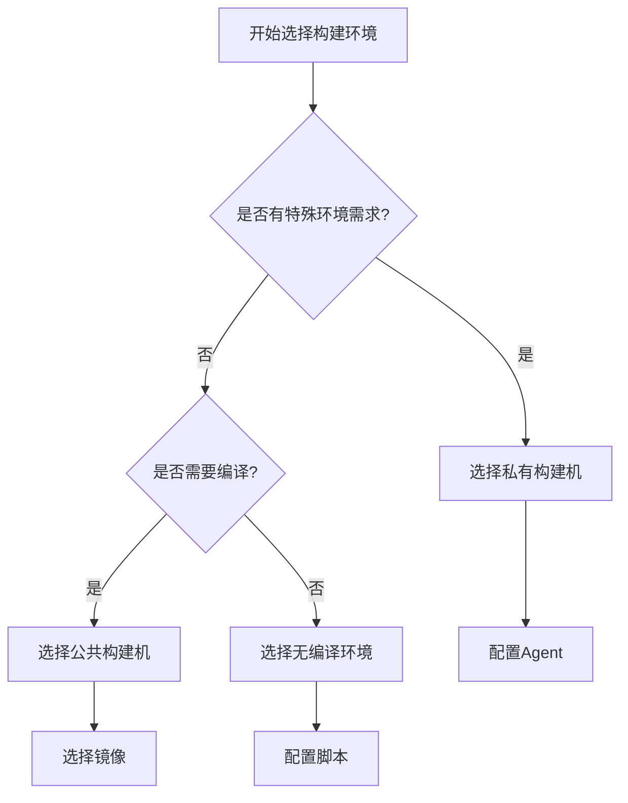
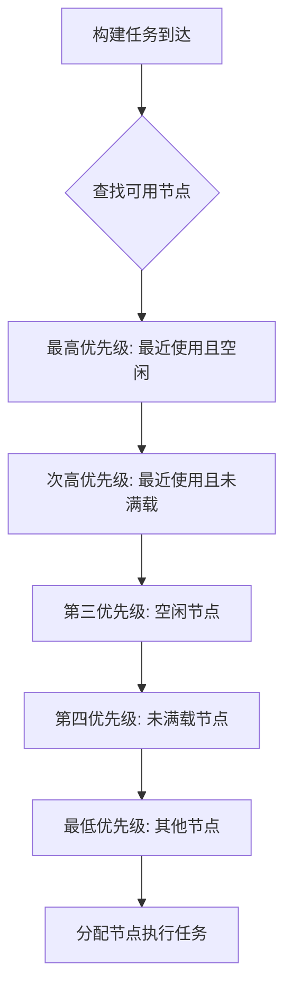

# 构建环境与Agent管理指南

## 目录

1. [构建环境概述](#构建环境概述)
2. [公共构建环境](#公共构建环境)
3. [私有构建机管理](#私有构建机管理)
4. [Agent 安装与配置](#agent-安装与配置)
5. [构建集群管理](#构建集群管理)
6. [环境变量与配置](#环境变量与配置)
7. [镜像管理](#镜像管理)
8. [网络与代理配置](#网络与代理配置)
9. [性能优化](#性能优化)
10. [故障排查](#故障排查)

---

## 构建环境概述

### 什么是构建环境

构建环境是流水线执行的基础设施，提供代码编译、测试、打包等操作所需的计算资源和运行环境。

### 构建环境类型

| 类型 | 说明 | 适用场景 | 资源配置 |
|------|------|----------|----------|
| **公共构建机** | 平台提供的共享资源 | 通用构建任务 | 标准化配置 |
| **私有构建机** | 用户自有的构建资源 | 特殊环境需求 | 自定义配置 |
| **无编译环境** | 轻量级执行环境 | 简单脚本任务 | 2核4G内存 |

### 构建环境选择原则



---

## 公共构建环境

### Linux 构建环境

#### Docker on DevCloud（推荐）

**特点**：
- ✅ 资源隔离（16核32G）
- ✅ 持久化存储（CBS盘）
- ✅ 支持并发构建
- ✅ 稳定性高

**配置示例**：
```yaml
# 流水线配置
jobs:
  build:
    runs-on: docker
    container:
      image: mirrors.tencent.com/ci/tlinux3_ci:2.6.0
    steps:
      - name: 编译代码
        run: |
          mvn clean package
```

#### 可用镜像列表

| 镜像名称 | 版本 | 包含工具 | 适用场景 |
|----------|------|----------|----------|
| `tlinux3_ci` | 2.6.0 | Java8/11, Maven, Gradle, Node.js | Java项目构建 |
| `tlinux3_ci` | 2.0.0 | 基础工具链 | 通用构建 |
| `android_ci` | latest | Android SDK, NDK | Android开发 |
| `golang_ci` | 1.19 | Go 1.19, Git | Go项目构建 |

#### 环境变量配置

```bash
# 系统预设环境变量
WORKSPACE=/data/landun/workspace
JAVA_HOME=/usr/lib/jvm/java-8-openjdk-amd64
MAVEN_HOME=/data/bkdevops/apps/maven
NODE_HOME=/data/bkdevops/apps/nodejs

# 代理配置
http_proxy=http://devnet-proxy.oa.com:8080
https_proxy=http://devnet-proxy.oa.com:8080
no_proxy=localhost,127.0.0.1,.oa.com,.woa.com
```

### Windows 构建环境

#### Windows Server 2019

**配置规格**：
- CPU: 8核
- 内存: 16GB
- 磁盘: 100GB

**预装软件**：
```
- Visual Studio 2019 Build Tools
- .NET Framework 4.8
- .NET Core 3.1/5.0/6.0
- PowerShell 5.1
- Git for Windows
- Python 3.9
```

**使用示例**：
```yaml
jobs:
  build-windows:
    runs-on: windows-2019
    steps:
      - name: 构建 .NET 项目
        run: |
          dotnet restore
          dotnet build --configuration Release
```

### macOS 构建环境

#### macOS 版本支持

| 版本 | Xcode版本 | 支持架构 | 状态 |
|------|-----------|----------|------|
| macOS 13 | 14.3.1 | x86_64, arm64 | ✅ 推荐 |
| macOS 12.4 | 13.4.1 | x86_64 | ✅ 稳定 |
| macOS 11.4 | 12.5.1 | x86_64 | ⚠️ 维护中 |

**配置示例**：
```yaml
jobs:
  build-ios:
    runs-on:
      pool-name: macos-13
      xcode: 14.3.1
    steps:
      - name: 构建 iOS 应用
        run: |
          xcodebuild -workspace MyApp.xcworkspace \
                     -scheme MyApp \
                     -configuration Release \
                     -archivePath MyApp.xcarchive \
                     archive
```

### 无编译环境

#### 特点与限制

**适用场景**：
- 脚本执行
- 文件处理
- 简单工具调用
- 通知发送

**资源限制**：
- CPU: 2核
- 内存: 2GB
- 网络: 无法访问工蜂
- 存储: 临时存储

**配置示例**：
```yaml
jobs:
  notify:
    runs-on: agentless
    steps:
      - name: 发送通知
        run: |
          curl -X POST "https://api.example.com/notify" \
               -H "Content-Type: application/json" \
               -d '{"message": "构建完成"}'
```

---

## 私有构建机管理

### 构建机接入流程

#### 1. 环境准备

**系统要求**：
- Linux: CentOS 7+, Ubuntu 16.04+
- Windows: Windows Server 2016+
- macOS: macOS 10.14+

**网络要求**：
- 能够访问 `devnet.devops.woa.com`
- 端口 80/443 开放
- 如有代理，需配置 `no_proxy`

**权限要求**：
- Linux/macOS: 具有 sudo 权限的用户
- Windows: 管理员权限

#### 2. 获取安装命令

```
蓝盾控制台 → 服务 → 环境管理 → 节点 → 导入 → 第三方构建机
```

**选择配置**：
1. **操作系统**：Linux/Windows/macOS
2. **接入区域**：选择就近区域（北京选天津）
3. **网络专区**：
   - OA内网专区：办公区、DevCloud机器
   - 云研发专区：离岸基地云桌面

#### 3. 执行安装

**Linux/macOS 安装**：
```bash
# 复制页面提供的安装命令，类似：
curl -H "X-DEVOPS-PROJECT-ID: demo" \
     "https://devnet.devops.woa.com/ms/environment/api/external/thirdPartyAgent/agents/xxx/install?os=LINUX" \
     | bash
```

**Windows 安装**：
1. 下载安装包
2. 以管理员身份运行
3. 按提示完成安装

#### 4. 验证安装

```bash
# 检查 Agent 状态
cd ${agent_install_dir}
./devopsAgent status

# 查看日志
tail -f logs/devopsAgent.log
```

### Agent 配置文件

#### .agent.properties 配置

```properties
# 基础配置
devops.project.id=your_project_id
devops.agent.id=agent_unique_id
devops.agent.secret.key=agent_secret

# 网络配置
devops.gateway=https://devnet.devops.woa.com
devops.agent.request.timeout.sec=15

# 并发配置
devops.parallel.task.count=4

# 工作空间配置
devops.agent.data.dir=/data/landun
```

#### 高级配置选项

```properties
# 自定义环境变量
devops.agent.env.PATH=/usr/local/bin:$PATH
devops.agent.env.JAVA_HOME=/usr/lib/jvm/java-8

# 资源限制
devops.agent.max.memory=8g
devops.agent.max.disk.space=100g

# 日志配置
devops.agent.log.level=INFO
devops.agent.log.max.days=7
```

### 构建机状态管理

#### 状态类型

| 状态 | 说明 | 操作 |
|------|------|------|
| **正常** | 可接受构建任务 | 无需操作 |
| **异常** | 网络或系统问题 | 检查网络和日志 |
| **维护中** | 人工设置维护状态 | 完成维护后启用 |
| **离线** | Agent 未运行 | 启动 Agent 服务 |

#### 状态操作

```bash
# 启动 Agent
./devopsAgent start

# 停止 Agent  
./devopsAgent stop

# 重启 Agent
./devopsAgent restart

# 查看状态
./devopsAgent status

# 卸载 Agent
./uninstall.sh
```

---

## Agent 安装与配置

### 批量安装

#### 脚本化安装

```bash
#!/bin/bash
# batch_install_agent.sh

SERVERS=(
    "192.168.1.10"
    "192.168.1.11" 
    "192.168.1.12"
)

INSTALL_CMD="curl -H 'X-DEVOPS-PROJECT-ID: demo' \
'https://devnet.devops.woa.com/ms/environment/api/external/thirdPartyAgent/agents/xxx/install?os=LINUX' \
| bash"

for server in "${SERVERS[@]}"; do
    echo "Installing agent on $server..."
    ssh root@$server "$INSTALL_CMD"
    
    if [ $? -eq 0 ]; then
        echo "✅ Agent installed successfully on $server"
    else
        echo "❌ Failed to install agent on $server"
    fi
done
```

#### Ansible 批量部署

```yaml
# ansible-playbook install-agents.yml
---
- hosts: build_servers
  become: yes
  vars:
    project_id: "your_project_id"
    install_url: "https://devnet.devops.woa.com/ms/environment/api/external/thirdPartyAgent/agents"
  
  tasks:
    - name: Create agent directory
      file:
        path: /data/landun
        state: directory
        mode: '0755'
    
    - name: Download and install agent
      shell: |
        curl -H "X-DEVOPS-PROJECT-ID: {{ project_id }}" \
             "{{ install_url }}/{{ agent_id }}/install?os=LINUX" | bash
      args:
        chdir: /data/landun
    
    - name: Start agent service
      shell: ./devopsAgent start
      args:
        chdir: /data/landun
```

### Agent 升级

#### 自动升级

Agent 支持自动升级，当有新版本时会自动下载并升级：

```bash
# 检查升级状态
grep "upgrade" logs/devopsAgent.log

# 手动触发升级检查
./devopsAgent upgrade
```

#### 手动升级

```bash
# 1. 停止当前 Agent
./devopsAgent stop

# 2. 备份配置
cp .agent.properties .agent.properties.bak

# 3. 下载新版本安装包
curl -o agent-upgrade.zip "https://devnet.devops.woa.com/ms/environment/api/external/thirdPartyAgent/upgrade"

# 4. 解压并替换
unzip agent-upgrade.zip
chmod +x devopsAgent

# 5. 恢复配置并启动
cp .agent.properties.bak .agent.properties
./devopsAgent start
```

### 多项目 Agent

#### 配置多项目支持

```bash
# 项目A的Agent配置
mkdir -p /data/landun/project-a
cd /data/landun/project-a
# 安装项目A的Agent

# 项目B的Agent配置  
mkdir -p /data/landun/project-b
cd /data/landun/project-b
# 安装项目B的Agent
```

#### 资源隔离

```bash
# 使用不同用户运行不同项目的Agent
useradd -m bk-project-a
useradd -m bk-project-b

# 项目A
su - bk-project-a
cd /home/bk-project-a/agent
./devopsAgent start

# 项目B  
su - bk-project-b
cd /home/bk-project-b/agent
./devopsAgent start
```

---

## 构建集群管理

### 创建构建集群

#### 1. 环境创建

```
蓝盾控制台 → 服务 → 环境管理 → 环境 → 新建环境
```

**配置项**：
- 环境名称：如 "编译集群"、"测试集群"
- 环境描述：集群用途说明
- 环境类型：构建集群

#### 2. 添加构建机

```
环境详情 → 添加节点 → 选择已导入的构建机
```

#### 3. 集群配置

```yaml
# 集群配置示例
cluster:
  name: "高性能编译集群"
  description: "用于大型项目编译的高配置集群"
  nodes:
    - id: "agent-001"
      labels: ["high-cpu", "large-memory"]
      max_parallel: 4
    - id: "agent-002" 
      labels: ["high-cpu", "large-memory"]
      max_parallel: 4
```

### 节点调度算法

#### 调度优先级



#### 调度策略配置

```json
{
  "schedulingPolicy": {
    "strategy": "balanced",
    "factors": {
      "recentUsage": 0.4,
      "currentLoad": 0.3,
      "nodeCapacity": 0.2,
      "nodeLabels": 0.1
    }
  }
}
```

### 负载均衡

#### 并发控制

```bash
# 设置节点最大并发数
# 环境管理 → 节点 → 详情 → 并发设置

# 高配置机器
max_parallel_jobs: 8

# 中等配置机器  
max_parallel_jobs: 4

# 低配置机器
max_parallel_jobs: 2
```

#### 资源监控

```bash
# 监控脚本示例
#!/bin/bash
# monitor_agents.sh

AGENTS=("agent-001" "agent-002" "agent-003")

for agent in "${AGENTS[@]}"; do
    echo "=== Agent: $agent ==="
    
    # CPU使用率
    cpu_usage=$(ssh $agent "top -bn1 | grep 'Cpu(s)' | awk '{print \$2}' | cut -d'%' -f1")
    echo "CPU Usage: ${cpu_usage}%"
    
    # 内存使用率
    mem_usage=$(ssh $agent "free | grep Mem | awk '{printf \"%.2f\", \$3/\$2 * 100.0}'")
    echo "Memory Usage: ${mem_usage}%"
    
    # 磁盘使用率
    disk_usage=$(ssh $agent "df -h / | awk 'NR==2{print \$5}'")
    echo "Disk Usage: $disk_usage"
    
    # 当前任务数
    current_jobs=$(ssh $agent "ps aux | grep -c 'devops-agent'")
    echo "Current Jobs: $current_jobs"
    
    echo ""
done
```

### 跨项目共享

#### 共享配置

```
环境管理 → 环境详情 → 共享设置 → 添加项目
```

**权限设置**：
- 使用权限：允许其他项目使用此环境
- 管理权限：允许其他项目管理此环境
- 查看权限：允许其他项目查看环境信息

#### 引用共享环境

```yaml
# 在其他项目中引用共享环境
resources:
  pools:
    - from: shared_project@high_performance_cluster
      name: shared-cluster

jobs:
  build:
    runs-on:
      self-hosted: true
      pool-name: shared-cluster
      agent-selector: ["linux"]
```

---

## 环境变量与配置

### 系统环境变量

#### 蓝盾内置变量

| 变量名 | 说明 | 示例值 |
|--------|------|--------|
| `BK_CI_PROJECT_NAME` | 项目英文名 | `demo-project` |
| `BK_CI_PIPELINE_ID` | 流水线ID | `p-12345678` |
| `BK_CI_BUILD_ID` | 构建ID | `b-87654321` |
| `BK_CI_BUILD_NUM` | 构建序号 | `100` |
| `WORKSPACE` | 工作空间路径 | `/data/landun/workspace` |

#### 工具链环境变量

```bash
# Java 环境
export JAVA_HOME=/usr/lib/jvm/java-8-openjdk-amd64
export PATH=$JAVA_HOME/bin:$PATH

# Maven 环境
export MAVEN_HOME=/data/bkdevops/apps/maven
export PATH=$MAVEN_HOME/bin:$PATH

# Node.js 环境
export NODE_HOME=/data/bkdevops/apps/nodejs
export PATH=$NODE_HOME/bin:$PATH

# Python 环境
export PYTHON_HOME=/usr/bin/python3
export PATH=$PYTHON_HOME:$PATH
```

### 自定义环境变量

#### 流水线级别

```yaml
# 在流水线中设置环境变量
env:
  BUILD_ENV: "production"
  API_BASE_URL: "https://api.example.com"
  DEBUG_MODE: "false"

jobs:
  build:
    steps:
      - name: 使用环境变量
        run: |
          echo "Build Environment: $BUILD_ENV"
          echo "API URL: $API_BASE_URL"
```

#### Job 级别

```yaml
jobs:
  build:
    env:
      MAVEN_OPTS: "-Xmx2g -XX:MaxPermSize=512m"
      GRADLE_OPTS: "-Dorg.gradle.daemon=false"
    steps:
      - name: Maven 构建
        run: mvn clean package
```

#### Step 级别

```yaml
steps:
  - name: 设置特定环境变量
    env:
      DATABASE_URL: "jdbc:mysql://localhost:3306/test"
      REDIS_URL: "redis://localhost:6379"
    run: |
      echo "Database: $DATABASE_URL"
      echo "Redis: $REDIS_URL"
```

### 配置文件管理

#### Maven 配置

```xml
<!-- /root/.m2/settings.xml -->
<settings>
  <mirrors>
    <mirror>
      <id>tencent</id>
      <mirrorOf>central</mirrorOf>
      <name>Tencent Maven Mirror</name>
      <url>https://mirrors.tencent.com/nexus/repository/maven-public/</url>
    </mirror>
  </mirrors>
  
  <profiles>
    <profile>
      <id>tencent</id>
      <repositories>
        <repository>
          <id>central</id>
          <url>https://mirrors.tencent.com/nexus/repository/maven-public/</url>
        </repository>
      </repositories>
    </profile>
  </profiles>
  
  <activeProfiles>
    <activeProfile>tencent</activeProfile>
  </activeProfiles>
</settings>
```

#### Gradle 配置

```groovy
// /root/.gradle/init.gradle
allprojects {
    repositories {
        maven { url 'https://mirrors.tencent.com/nexus/repository/maven-public/' }
        maven { url 'https://mirrors.tencent.com/repository/gradle-plugins/' }
        mavenCentral()
    }
}
```

#### NPM 配置

```bash
# /root/.npmrc
registry=https://mirrors.tencent.com/npm/
sass_binary_site=https://mirrors.tencent.com/node-sass/
phantomjs_cdnurl=https://mirrors.tencent.com/phantomjs/
electron_mirror=https://mirrors.tencent.com/electron/
```

---

## 镜像管理

### 官方镜像

#### 推荐镜像列表

| 镜像 | 标签 | 大小 | 包含组件 |
|------|------|------|----------|
| `mirrors.tencent.com/ci/tlinux3_ci` | 2.6.0 | 2.1GB | Java8/11, Maven, Gradle, Node.js 16 |
| `mirrors.tencent.com/ci/android_ci` | latest | 3.5GB | Android SDK 30, NDK r21 |
| `mirrors.tencent.com/ci/golang_ci` | 1.19 | 1.2GB | Go 1.19, Git, Make |
| `mirrors.tencent.com/ci/python_ci` | 3.9 | 1.8GB | Python 3.9, pip, virtualenv |

#### 镜像选择指南

```yaml
# Java 项目
container:
  image: mirrors.tencent.com/ci/tlinux3_ci:2.6.0

# Android 项目  
container:
  image: mirrors.tencent.com/ci/android_ci:latest

# Go 项目
container:
  image: mirrors.tencent.com/ci/golang_ci:1.19

# Python 项目
container:
  image: mirrors.tencent.com/ci/python_ci:3.9

# 自定义镜像
container:
  image: your-registry.com/your-image:tag
  credentials: your-registry-credential
```

### 自定义镜像

#### 镜像制作要求

**基础要求**：
1. 必须使用 `root` 用户
2. 必须基于 Linux 发行版
3. 必须包含基础工具：`curl`, `wget`, `git`

**Dockerfile 示例**：
```dockerfile
FROM mirrors.tencent.com/ci/tlinux3_ci:2.0.0

# 设置用户为 root
USER root

# 更新软件源
RUN yum update -y && yum install -y \
    gcc \
    gcc-c++ \
    make \
    cmake \
    && yum clean all

# 安装 Node.js 18
RUN curl -fsSL https://nodejs.org/dist/v18.17.0/node-v18.17.0-linux-x64.tar.xz \
    | tar -xJ -C /usr/local --strip-components=1

# 设置环境变量
ENV NODE_HOME=/usr/local
ENV PATH=$NODE_HOME/bin:$PATH

# 创建工作目录
RUN mkdir -p /data/landun/workspace
WORKDIR /data/landun/workspace

# 设置默认命令
CMD ["/bin/bash"]
```

#### 镜像构建与推送

```bash
# 构建镜像
docker build -t your-registry.com/custom-ci:1.0.0 .

# 推送镜像
docker push your-registry.com/custom-ci:1.0.0

# 在蓝盾中使用
# 选择"第三方镜像"，输入完整镜像地址
```

### 镜像优化

#### 多阶段构建

```dockerfile
# 构建阶段
FROM mirrors.tencent.com/ci/tlinux3_ci:2.6.0 AS builder

COPY . /src
WORKDIR /src
RUN mvn clean package -DskipTests

# 运行阶段
FROM mirrors.tencent.com/ci/tlinux3_ci:2.0.0

COPY --from=builder /src/target/*.jar /app/app.jar
WORKDIR /app

CMD ["java", "-jar", "app.jar"]
```

#### 缓存优化

```dockerfile
# 优化依赖安装顺序
FROM mirrors.tencent.com/ci/tlinux3_ci:2.6.0

# 先复制依赖文件
COPY pom.xml /app/
COPY package.json /app/
WORKDIR /app

# 安装依赖（利用Docker缓存）
RUN mvn dependency:go-offline
RUN npm install

# 再复制源代码
COPY . /app/

# 构建应用
RUN mvn package -DskipTests
```

---

## 网络与代理配置

### 代理配置

#### 系统代理设置

```bash
# 设置HTTP代理
export http_proxy=http://devnet-proxy.oa.com:8080
export https_proxy=http://devnet-proxy.oa.com:8080
export ftp_proxy=http://devnet-proxy.oa.com:8080

# 设置不走代理的地址
export no_proxy=localhost,127.0.0.1,.oa.com,.woa.com,mirrors.tencent.com
```

#### 工具特定代理

**Maven 代理**：
```xml
<settings>
  <proxies>
    <proxy>
      <id>devnet-proxy</id>
      <active>true</active>
      <protocol>http</protocol>
      <host>devnet-proxy.oa.com</host>
      <port>8080</port>
      <nonProxyHosts>*.oa.com|*.woa.com|mirrors.tencent.com</nonProxyHosts>
    </proxy>
  </proxies>
</settings>
```

**Gradle 代理**：
```properties
# gradle.properties
systemProp.http.proxyHost=devnet-proxy.oa.com
systemProp.http.proxyPort=8080
systemProp.https.proxyHost=devnet-proxy.oa.com
systemProp.https.proxyPort=8080
systemProp.http.nonProxyHosts=*.oa.com|*.woa.com|mirrors.tencent.com
```

**NPM 代理**：
```bash
npm config set proxy http://devnet-proxy.oa.com:8080
npm config set https-proxy http://devnet-proxy.oa.com:8080
npm config set registry https://mirrors.tencent.com/npm/
```

### 网络策略

#### 访问控制

```bash
# 检查网络连通性
telnet devnet.devops.woa.com 80
ping mirrors.tencent.com

# 检查代理配置
curl -I http://www.google.com
curl -I https://mirrors.tencent.com
```

#### 防火墙配置

```bash
# CentOS/RHEL 防火墙配置
firewall-cmd --permanent --add-port=80/tcp
firewall-cmd --permanent --add-port=443/tcp
firewall-cmd --reload

# Ubuntu 防火墙配置
ufw allow 80/tcp
ufw allow 443/tcp
ufw reload
```

### DNS 配置

#### DNS 解析问题

```bash
# 检查DNS解析
nslookup devnet.devops.woa.com
dig devnet.devops.woa.com

# 配置DNS服务器
echo "nameserver 8.8.8.8" >> /etc/resolv.conf
echo "nameserver 114.114.114.114" >> /etc/resolv.conf
```

#### 本地 hosts 配置

```bash
# /etc/hosts
127.0.0.1 localhost
::1 localhost

# 蓝盾相关域名
10.0.0.1 devnet.devops.woa.com
10.0.0.2 mirrors.tencent.com
```

---

## 性能优化

### 缓存策略

#### Workspace 缓存

```yaml
# 利用 workspace 缓存
jobs:
  build:
    steps:
      - name: 恢复缓存
        run: |
          if [ -d "$WORKSPACE/.m2" ]; then
            cp -r $WORKSPACE/.m2 /root/
          fi
      
      - name: Maven 构建
        run: mvn clean package
      
      - name: 保存缓存
        run: |
          mkdir -p $WORKSPACE/.m2
          cp -r /root/.m2/* $WORKSPACE/.m2/
```

#### 依赖缓存

```bash
# Maven 依赖缓存目录
/root/.m2/repository

# Gradle 缓存目录
/root/.gradle/caches

# NPM 缓存目录
/root/.npm

# Docker 镜像缓存
/var/lib/docker
```

### 并发优化

#### 并行构建配置

```bash
# Maven 并行构建
mvn clean package -T 4

# Gradle 并行构建
gradle build --parallel --max-workers=4

# Make 并行构建
make -j4
```

#### 资源分配

```yaml
# 合理分配构建机资源
jobs:
  # CPU密集型任务
  compile:
    runs-on:
      self-hosted: true
      pool-name: high-cpu-cluster
      
  # IO密集型任务  
  test:
    runs-on:
      self-hosted: true
      pool-name: high-io-cluster
      
  # 内存密集型任务
  package:
    runs-on:
      self-hosted: true
      pool-name: high-memory-cluster
```

### 磁盘优化

#### 清理策略

```bash
#!/bin/bash
# cleanup_workspace.sh

# 清理临时文件
find $WORKSPACE -name "*.tmp" -delete
find $WORKSPACE -name "*.log" -mtime +7 -delete

# 清理构建产物
rm -rf $WORKSPACE/target
rm -rf $WORKSPACE/build
rm -rf $WORKSPACE/node_modules

# 清理Docker镜像
docker system prune -f
docker image prune -f
```

#### 磁盘监控

```bash
#!/bin/bash
# monitor_disk.sh

THRESHOLD=80
USAGE=$(df -h / | awk 'NR==2{print $5}' | cut -d'%' -f1)

if [ $USAGE -gt $THRESHOLD ]; then
    echo "⚠️ 磁盘使用率过高: ${USAGE}%"
    
    # 清理缓存
    rm -rf /tmp/*
    docker system prune -f
    
    # 发送告警
    curl -X POST "https://api.example.com/alert" \
         -d "disk_usage=${USAGE}%"
fi
```

---

## 故障排查

### 常见问题

#### 1. Agent 无法连接

**症状**：
```
ERROR: Failed to connect to devnet.devops.woa.com
```

**排查步骤**：
```bash
# 1. 检查网络连通性
telnet devnet.devops.woa.com 80

# 2. 检查DNS解析
nslookup devnet.devops.woa.com

# 3. 检查代理配置
echo $http_proxy
echo $no_proxy

# 4. 检查防火墙
iptables -L
firewall-cmd --list-all
```

**解决方案**：
```bash
# 配置代理
export http_proxy=http://devnet-proxy.oa.com:8080
export no_proxy=localhost,127.0.0.1,.oa.com,.woa.com

# 或者添加到 .bashrc
echo 'export http_proxy=http://devnet-proxy.oa.com:8080' >> ~/.bashrc
echo 'export no_proxy=localhost,127.0.0.1,.oa.com,.woa.com' >> ~/.bashrc
```

#### 2. 构建环境无可分配构建机

**症状**：
```
No available build agents in the environment
```

**排查步骤**：
```bash
# 1. 检查构建机状态
curl -H "X-DEVOPS-PROJECT-ID: $PROJECT_ID" \
     "https://devnet.devops.woa.com/ms/environment/api/user/envs/$ENV_ID/nodes"

# 2. 检查Agent状态
./devopsAgent status

# 3. 查看Agent日志
tail -f logs/devopsAgent.log
```

**解决方案**：
- 启动离线的Agent
- 增加构建机到环境
- 调整并发配置

#### 3. 镜像拉取失败

**症状**：
```
Error response from daemon: pull access denied
```

**排查步骤**：
```bash
# 1. 检查镜像地址
docker pull mirrors.tencent.com/ci/tlinux3_ci:2.6.0

# 2. 检查凭证配置
docker login mirrors.tencent.com

# 3. 检查网络连接
curl -I https://mirrors.tencent.com
```

**解决方案**：
```bash
# 配置镜像仓库凭证
docker login -u username -p password mirrors.tencent.com

# 或使用公共镜像
image: mirrors.tencent.com/ci/tlinux3_ci:2.0.0
```

### 日志分析

#### Agent 日志

```bash
# 查看Agent运行日志
tail -f logs/devopsAgent.log

# 查看任务执行日志
tail -f logs/build-*.log

# 搜索错误信息
grep -i error logs/devopsAgent.log
grep -i exception logs/devopsAgent.log
```

#### 系统日志

```bash
# 系统日志
journalctl -u devops-agent -f

# 内核日志
dmesg | tail -20

# 网络日志
netstat -tulpn | grep :80
ss -tulpn | grep :80
```

### 性能分析

#### 资源监控

```bash
#!/bin/bash
# performance_monitor.sh

echo "=== CPU Usage ==="
top -bn1 | grep "Cpu(s)" | awk '{print $2}'

echo "=== Memory Usage ==="
free -h

echo "=== Disk Usage ==="
df -h

echo "=== Network Connections ==="
netstat -an | grep ESTABLISHED | wc -l

echo "=== Load Average ==="
uptime

echo "=== Running Processes ==="
ps aux | grep devops | grep -v grep
```

#### 性能调优

```bash
# 调整系统参数
echo 'vm.swappiness=10' >> /etc/sysctl.conf
echo 'net.core.somaxconn=65535' >> /etc/sysctl.conf
sysctl -p

# 调整文件描述符限制
echo '* soft nofile 65535' >> /etc/security/limits.conf
echo '* hard nofile 65535' >> /etc/security/limits.conf

# 调整Agent配置
echo 'devops.parallel.task.count=8' >> .agent.properties
echo 'devops.agent.max.memory=16g' >> .agent.properties
```

---

## 总结

本章节全面介绍了蓝盾的构建环境与Agent管理，涵盖了从基础概念到高级配置的所有内容。

### 关键要点

1. **构建环境选择**：根据项目需求选择合适的构建环境类型
2. **Agent管理**：正确安装、配置和维护构建机Agent
3. **集群管理**：合理组织构建资源，实现负载均衡
4. **性能优化**：通过缓存、并发等手段提升构建效率
5. **故障排查**：掌握常见问题的诊断和解决方法

### 最佳实践

- ✅ **环境标准化**：使用统一的镜像和配置
- ✅ **资源监控**：定期检查构建机状态和性能
- ✅ **缓存策略**：合理利用各种缓存机制
- ✅ **网络配置**：正确配置代理和DNS
- ✅ **安全管理**：定期更新Agent和系统补丁

通过遵循本指南的建议，您可以构建一个稳定、高效的构建环境，为团队的CI/CD流程提供可靠的基础设施支持。