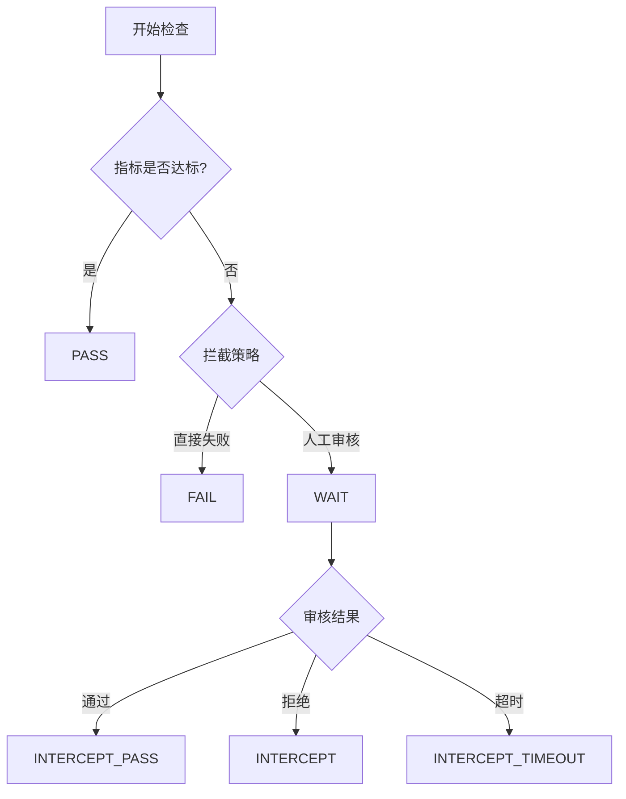

# 质量红线与代码检查指南

## 概述

质量红线是蓝盾提供的质量管控服务，通过设置质量标准来控制流水线的行为，确保软件产出物符合质量要求。它支持代码检查、测试覆盖率、安全扫描等多维度的质量指标，是研发流程中的"安灯系统"。

## 质量红线核心概念

### 1. 什么是质量红线

质量红线通过设置质量标准，控制流水线的行为，使得其产出物必须符合质量标准。主要应用场景：

- **Merge Request代码检视**: 确保合入代码符合团队规范，无严重告警
- **版本转测**: 保障单元测试通过，代码覆盖率达标
- **版本发布**: 进行全面的缺陷和安全检查，通过冒烟测试

### 2. 质量红线的作用

- **质量门禁**: 在关键节点设置质量检查点
- **自动拦截**: 不符合标准的代码无法进入下一阶段
- **质量可视化**: 直观展示质量指标和趋势
- **流程标准化**: 统一团队的质量标准和流程

## 支持的指标类型

### 1. CodeCC代码检查指标

#### 五大维度指标
- **代码缺陷**: Coverity、Klocwork等工具检测的缺陷
- **代码安全**: 安全漏洞和风险检测
- **代码规范**: 编码规范和风格检查
- **重复代码**: 代码重复度检测
- **复杂度**: 圈复杂度、认知复杂度等

#### 预设指标集
```yaml
# 腾讯开源规范指标集
indicators:
  - name: "严重缺陷数"
    tool: "coverity"
    threshold: 0
    operator: "LTE"
  
  - name: "安全漏洞数"
    tool: "security"
    threshold: 0
    operator: "EQ"

# 代码安全指标集
security_indicators:
  - name: "高危安全漏洞"
    severity: "HIGH"
    threshold: 0
  
  - name: "中危安全漏洞"
    severity: "MEDIUM"
    threshold: 5

# 内存相关指标集
memory_indicators:
  - name: "内存泄漏"
    category: "MEMORY_LEAK"
    threshold: 0
  
  - name: "空指针引用"
    category: "NULL_POINTER"
    threshold: 0
```

### 2. 自定义指标

#### 测试相关指标
```yaml
# 单元测试覆盖率
- name: "代码覆盖率"
  type: "FLOAT"
  threshold: 80.0
  operator: "GTE"
  
# 测试用例通过率
- name: "测试通过率"
  type: "FLOAT"
  threshold: 95.0
  operator: "GTE"

# 自动化测试用例数
- name: "自动化用例数"
  type: "INT"
  threshold: 100
  operator: "GTE"
```

#### 性能相关指标
```yaml
# 构建时间
- name: "构建时间"
  type: "INT"
  threshold: 600  # 10分钟
  operator: "LTE"
  unit: "seconds"

# 包大小
- name: "应用包大小"
  type: "FLOAT"
  threshold: 50.0  # 50MB
  operator: "LTE"
  unit: "MB"
```

### 3. 研发商店插件指标

插件开发者可以定义自己的质量指标：

#### quality.json配置
```json
{
  "stage": "TEST",
  "indicators": {
    "security_scan_score": {
      "label": "安全扫描评分",
      "type": "INT",
      "desc": "安全扫描综合评分",
      "availableOp": "GTE,GT,EQ",
      "defaultOp": "GTE",
      "threshold": "80",
      "readOnly": false,
      "logPrompt": "安全扫描未通过，详情查看: <a href='${{ SCAN_REPORT_URL }}'>扫描报告</a>"
    },
    "vulnerability_count": {
      "label": "漏洞数量",
      "type": "INT",
      "desc": "检测到的安全漏洞数量",
      "availableOp": "LT,LE,EQ",
      "defaultOp": "EQ",
      "threshold": "0",
      "readOnly": false
    }
  }
}
```

#### 插件输出格式
```json
{
  "status": "success",
  "message": "Security scan completed",
  "type": "quality",
  "data": {
    "scanReport": {
      "type": "string",
      "value": "https://security-scan.example.com/report/123"
    }
  },
  "qualityData": {
    "security_scan_score": {
      "value": "85"
    },
    "vulnerability_count": {
      "value": "2"
    }
  }
}
```

## 质量红线配置

### 1. 蓝盾界面配置

#### 创建质量红线规则
1. 进入质量红线服务页面
2. 选择"快捷创建规则"
3. 选择合适的模板（如"版本转测"、"代码合入"）
4. 配置指标和阈值
5. 设置生效范围
6. 选择拦截策略

#### 快捷模板示例

##### 代码合入模板
```yaml
template: "code_merge"
indicators:
  - name: "Coverity严重缺陷"
    threshold: 0
    operator: "EQ"
  - name: "代码规范告警"
    threshold: 10
    operator: "LTE"
  - name: "重复代码率"
    threshold: 20
    operator: "LTE"
    unit: "%"
```

##### 版本转测模板
```yaml
template: "version_test"
indicators:
  - name: "单元测试覆盖率"
    threshold: 70
    operator: "GTE"
    unit: "%"
  - name: "自动化用例通过率"
    threshold: 95
    operator: "GTE"
    unit: "%"
  - name: "安全漏洞数"
    threshold: 0
    operator: "EQ"
```

##### 版本发布模板
```yaml
template: "version_release"
indicators:
  - name: "代码覆盖率"
    threshold: 80
    operator: "GTE"
    unit: "%"
  - name: "性能测试通过率"
    threshold: 100
    operator: "EQ"
    unit: "%"
  - name: "安全扫描评分"
    threshold: 90
    operator: "GTE"
```

### 2. Stream YAML配置

#### Stage准入/准出配置
```yaml
version: v2.0

on:
  push:
    branches: ["main", "develop"]
  mr:
    target-branches: ["main"]

stages:
- name: "代码检查"
  check-out:
    gates:
      - template: quality_gates.yml
        parameters:
          receivers: ["${{ ci.actor }}", "qa-team"]
    timeout-hours: 2
  jobs:
    code_analysis:
      steps:
      - checkout: self
      - uses: CodeccCheckAtom@latest
        with:
          languages: ["JAVA", "JAVASCRIPT"]
          toolScanType: 0
```

#### 质量红线模板文件
```yaml
# .ci/templates/quality_gates.yml
parameters:
- name: receivers
  type: array
  default: ["${{ ci.actor }}"]
- name: max_defects
  type: number
  default: 0

gates:
- name: "代码质量检查"
  rule:
    - "CodeccCheckAtom.coverity_serious_defect <= ${{ parameters.max_defects }}"
    - "CodeccCheckAtom.sensitive_defect < 1"
    - "CodeccCheckAtom.code_duplication <= 20"
  notify-on-fail:
    - type: wework-message
      receivers: ${{ parameters.receivers }}
    - type: email
      receivers: ${{ parameters.receivers }}
  continue-on-fail:
    gatekeepers:
      - "${{ ci.actor }}"
      - "tech-lead"

- name: "安全检查"
  rule:
    - "SecurityScanAtom.high_risk_count == 0"
    - "SecurityScanAtom.medium_risk_count <= 5"
  notify-on-fail:
    - type: wework-message
      receivers: ["security-team"]
```

### 3. 高级配置

#### 多插件实例处理
```yaml
# 处理同一插件的多个实例
gates:
- name: "多语言代码检查"
  rule:
    # 格式：插件code.步骤名称.指标名 操作符 阈值
    - "CodeccCheckAtom.java-check.serious_defect <= 0"
    - "CodeccCheckAtom.js-check.serious_defect <= 0"
    - "CodeccCheckAtom.python-*.serious_defect <= 2"  # 支持通配符
```

#### 条件化质量红线
```yaml
# 根据分支设置不同的质量标准
parameters:
- name: branch_type
  type: string
  default: "${{ ci.branch }}"

gates:
- name: "分支质量检查"
  rule:
    # 主分支要求更严格
    - "${{ parameters.branch_type == 'main' ? 'CodeccCheckAtom.serious_defect == 0' : 'CodeccCheckAtom.serious_defect <= 2' }}"
```

## 控制点和拦截策略

### 1. 控制点类型

#### 蓝盾流水线控制点
- **插件准入**: 在插件执行前进行检查
- **插件准出**: 在插件执行后进行检查
- **Stage准入**: 在Stage开始前进行检查
- **Stage准出**: 在Stage结束后进行检查

#### Stream流水线控制点
- **Stage准入**: check-in配置
- **Stage准出**: check-out配置

### 2. 拦截策略

#### 直接终止
```yaml
intercept_strategy: "FAIL"
description: "质量检查失败时直接终止流水线"
```

#### 人工审核
```yaml
intercept_strategy: "MANUAL_REVIEW"
reviewers: ["tech-lead", "qa-manager"]
timeout_hours: 24
description: "质量检查失败时需要人工审核决定是否继续"
```

#### 通知后继续
```yaml
intercept_strategy: "NOTIFY_CONTINUE"
notify:
  - type: "wework-message"
    receivers: ["dev-team", "qa-team"]
  - type: "email"
    receivers: ["manager@company.com"]
```

### 3. 审核流程

#### 多级审核
```yaml
check-in:
  reviews:
    flows:
      - name: "开发负责人审核"
        reviewers: ["dev-lead"]
      - name: "QA审核"
        reviewers: ["qa-lead", "qa-engineer"]
    variables:
      urgency_level:
        label: "紧急程度"
        type: "SELECTOR"
        values: ["低", "中", "高", "紧急"]
        default: "中"
    description: |
      请审核以下内容：
      1. 代码质量是否达标
      2. 测试覆盖率是否充分
      3. 是否存在安全风险
```

## 自定义指标实现

### 1. 脚本任务上报指标

#### 单元测试覆盖率
```bash
#!/bin/bash

# 执行单元测试并生成覆盖率报告
mvn clean test jacoco:report

# 解析覆盖率数据
COVERAGE=$(grep -o 'Total.*[0-9]\+%' target/site/jacoco/index.html | grep -o '[0-9]\+' | tail -1)

# 上报质量红线指标
echo "##[set-quality]CodeCoverage=$COVERAGE"

# 也可以上报多个指标
echo "##[set-quality]TestCount=150"
echo "##[set-quality]TestPassRate=98.5"
```

#### 性能测试指标
```python
#!/usr/bin/env python3
import json
import subprocess

# 执行性能测试
result = subprocess.run(['jmeter', '-n', '-t', 'test.jmx', '-l', 'result.jtl'], 
                       capture_output=True, text=True)

# 解析性能测试结果
with open('result.jtl', 'r') as f:
    lines = f.readlines()
    
total_requests = len(lines) - 1  # 减去标题行
failed_requests = sum(1 for line in lines[1:] if 'false' in line.split(',')[7])
success_rate = ((total_requests - failed_requests) / total_requests) * 100

avg_response_time = sum(float(line.split(',')[1]) for line in lines[1:]) / total_requests

# 上报指标
print(f"##[set-quality]PerformanceSuccessRate={success_rate:.2f}")
print(f"##[set-quality]AvgResponseTime={avg_response_time:.0f}")
```

### 2. 插件集成质量指标

#### 安全扫描插件示例
```python
# security_scan_plugin.py
import json
import sys

def run_security_scan():
    # 执行安全扫描逻辑
    scan_results = {
        'high_risk_count': 0,
        'medium_risk_count': 3,
        'low_risk_count': 15,
        'scan_score': 85
    }
    
    # 输出插件结果
    output = {
        "status": "success",
        "message": "Security scan completed successfully",
        "type": "quality",
        "data": {
            "scanReport": {
                "type": "string", 
                "value": f"https://security.example.com/report/{build_id}"
            }
        },
        "qualityData": {
            "high_risk_count": {"value": str(scan_results['high_risk_count'])},
            "medium_risk_count": {"value": str(scan_results['medium_risk_count'])},
            "scan_score": {"value": str(scan_results['scan_score'])}
        }
    }
    
    print(json.dumps(output))

if __name__ == "__main__":
    run_security_scan()
```

## 质量红线状态管理

### 1. 红线状态类型

| 状态 | 说明 | 场景 |
|------|------|------|
| PASS | 已通过 | 所有指标都满足阈值要求 |
| FAIL | 拦截后直接终止 | 指标不达标且配置为直接失败 |
| WAIT | 拦截后审核中 | 指标不达标，等待人工审核 |
| INTERCEPT | 拦截后审核终止 | 人工审核决定终止流水线 |
| INTERCEPT_PASS | 拦截后审核继续 | 人工审核决定忽略问题继续执行 |
| INTERCEPT_TIMEOUT | 拦截后超时终止 | 审核超时自动终止 |
| UNCHECK | 待检查 | Stream红线特有，尚未检查 |

### 2. 状态流转



### 3. API查询状态

```bash
# 查询质量红线状态
curl -X GET \
  "https://devops.oa.com/ms/quality/api/user/rules/{ruleId}/builds/{buildId}" \
  -H "Authorization: Bearer $TOKEN"

# 响应示例
{
  "status": "WAIT",
  "ruleName": "代码质量检查",
  "indicators": [
    {
      "name": "严重缺陷数",
      "actualValue": 3,
      "threshold": 0,
      "operator": "EQ",
      "result": "FAIL"
    }
  ],
  "reviewers": ["tech-lead"],
  "createTime": "2024-01-15T10:30:00Z"
}
```

## 最佳实践

### 1. 指标设计原则

#### 渐进式质量提升
```yaml
# 阶段1：基础质量要求
basic_quality:
  serious_defects: 0
  security_high_risk: 0
  code_coverage: 60

# 阶段2：提升质量要求  
improved_quality:
  serious_defects: 0
  security_high_risk: 0
  security_medium_risk: 5
  code_coverage: 70
  code_duplication: 15

# 阶段3：高质量要求
high_quality:
  serious_defects: 0
  security_high_risk: 0
  security_medium_risk: 0
  code_coverage: 80
  code_duplication: 10
  complexity_score: 8
```

#### 分层质量标准
```yaml
# 不同环境的质量要求
environments:
  development:
    code_coverage: 50
    test_pass_rate: 90
  
  testing:
    code_coverage: 70
    test_pass_rate: 95
    security_scan: true
  
  production:
    code_coverage: 80
    test_pass_rate: 100
    security_scan: true
    performance_test: true
```

### 2. 团队协作配置

#### 角色权限设置
```yaml
roles:
  developer:
    can_view_quality_report: true
    can_request_review: true
    can_ignore_quality_gate: false
  
  tech_lead:
    can_view_quality_report: true
    can_approve_quality_gate: true
    can_modify_quality_rules: true
  
  qa_manager:
    can_view_quality_report: true
    can_approve_quality_gate: true
    can_modify_quality_rules: true
    can_create_quality_rules: true
```

#### 通知策略
```yaml
notifications:
  quality_gate_failed:
    immediate:
      - type: wework-message
        receivers: ["${{ ci.actor }}"]
    daily_summary:
      - type: email
        receivers: ["tech-lead", "qa-manager"]
  
  quality_gate_passed:
    - type: wework-message
      receivers: ["${{ ci.actor }}"]
      message: "🎉 质量检查通过，可以继续部署"
```

### 3. 持续改进

#### 质量趋势监控
```yaml
# 定期生成质量报告
quality_report:
  schedule: "0 9 * * 1"  # 每周一上午9点
  metrics:
    - code_coverage_trend
    - defect_density_trend
    - security_risk_trend
    - build_success_rate
  
  recipients:
    - "dev-team@company.com"
    - "qa-team@company.com"
    - "management@company.com"
```

#### 质量规则优化
```yaml
# 基于历史数据调整阈值
optimization:
  review_cycle: "monthly"
  criteria:
    - name: "false_positive_rate"
      threshold: 10  # 误报率超过10%需要调整
    - name: "pass_rate"
      threshold: 80  # 通过率低于80%需要放宽标准
```

## 故障排查

### 1. 常见问题

#### 指标未生成
```bash
# 检查插件是否正确输出指标
grep "##\[set-quality\]" build.log

# 检查插件输出格式
cat plugin_output.json | jq '.qualityData'
```

#### 红线未触发
```bash
# 检查红线规则配置
curl -X GET "https://devops.oa.com/ms/quality/api/user/rules" \
  -H "Authorization: Bearer $TOKEN"

# 检查流水线是否在生效范围内
curl -X GET "https://devops.oa.com/ms/quality/api/user/rules/{ruleId}/pipelines" \
  -H "Authorization: Bearer $TOKEN"
```

#### 审核流程异常
```bash
# 查看审核记录
curl -X GET "https://devops.oa.com/ms/quality/api/user/intercepts/{interceptId}" \
  -H "Authorization: Bearer $TOKEN"

# 重新发起审核
curl -X POST "https://devops.oa.com/ms/quality/api/user/intercepts/{interceptId}/retry" \
  -H "Authorization: Bearer $TOKEN"
```

### 2. 性能优化

#### 减少检查时间
```yaml
# 并行执行多个检查
parallel_checks:
  - name: "代码扫描"
    plugin: "CodeccCheckAtom"
  - name: "安全扫描"  
    plugin: "SecurityScanAtom"
  - name: "单元测试"
    plugin: "UnitTestAtom"
```

#### 增量检查
```yaml
# 只检查变更的代码
incremental_check:
  enabled: true
  base_branch: "main"
  file_patterns:
    - "src/**/*.java"
    - "src/**/*.js"
  exclude_patterns:
    - "**/*Test.java"
    - "**/test/**"
```

## 总结

质量红线是保障软件质量的重要工具，通过合理配置质量指标和拦截策略，可以：

1. **提前发现问题**: 在开发阶段就发现质量问题
2. **标准化流程**: 统一团队的质量标准和检查流程  
3. **降低风险**: 防止低质量代码进入生产环境
4. **持续改进**: 通过数据驱动不断优化质量标准

建议团队根据项目特点和质量要求，制定适合的质量红线策略，并在实践中不断优化和完善。