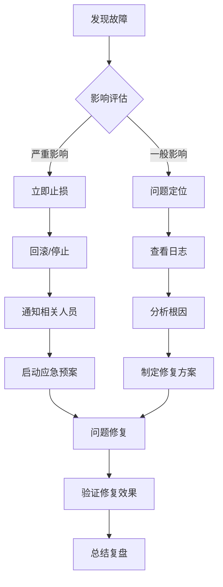

# BK-CI 故障排查完整指南

## 📋 目录

本指南提供 BK-CI 平台各功能模块的详细故障排查方法，帮助用户快速定位和解决问题。

### 🔍 快速导航

| 问题类型 | 描述 | 详细文档 |
|----------|------|----------|
| **流水线问题** | 执行失败、触发异常、配置错误 | [流水线排查指南](./reference/01-pipeline-troubleshooting.md) |
| **插件问题** | 插件执行异常、配置问题、版本兼容 | [插件排查指南](./reference/02-plugin-troubleshooting.md) |
| **代码检查问题** | CodeCC 扫描异常、规则配置、质量门禁 | [代码检查排查指南](./reference/03-codecc-troubleshooting.md) |
| **质量红线问题** | 红线拦截、指标配置、准入准出 | [质量红线排查指南](./reference/04-quality-troubleshooting.md) |
| **环境问题** | 构建机异常、网络问题、依赖缺失 | [环境排查指南](./reference/05-environment-troubleshooting.md) |
| **制品库问题** | 上传下载失败、存储问题、权限异常 | [制品库排查指南](./reference/06-artifact-troubleshooting.md) |
| **权限问题** | 访问被拒绝、权限不足、IAM 配置 | [权限排查指南](./reference/07-permission-troubleshooting.md) |
| **网络问题** | 连接超时、代理配置、防火墙限制 | [网络排查指南](./reference/08-network-troubleshooting.md) |
| **性能问题** | 执行缓慢、资源不足、并发限制 | [性能排查指南](./reference/09-performance-troubleshooting.md) |

---

## 🚨 紧急故障处理

### 生产环境故障应急流程



### 🔥 紧急联系方式

| 问题类型 | 联系方式 | 响应时间 |
|----------|----------|----------|
| **平台故障** | BK-CI 技术支持群 | 15分钟内 |
| **安全问题** | 安全应急热线 | 立即响应 |
| **插件问题** | 插件作者/社区 | 1-4小时 |
| **业务影响** | 项目负责人 | 30分钟内 |

---

## 🔍 问题诊断流程

### 标准排查步骤

#### 1. 问题现象收集
```bash
# 收集基础信息
- 问题发生时间
- 影响范围和用户
- 错误现象描述
- 复现步骤
- 环境信息
```

#### 2. 日志分析
```bash
# 查看相关日志
- 构建日志：流水线执行详情
- 系统日志：平台运行状态
- 插件日志：插件执行输出
- 网络日志：连接和传输记录
```

#### 3. 环境检查
```bash
# 验证环境状态
- 构建机状态和资源
- 网络连通性
- 依赖服务状态
- 权限配置
```

#### 4. 配置验证
```bash
# 检查配置正确性
- 流水线配置
- 插件参数
- 环境变量
- 触发器设置
```

---

## 📊 常见错误码速查

### 平台错误码分类

| 错误码范围 | 模块 | 说明 | 处理建议 |
|------------|------|------|----------|
| `2101xxx` | Process | 流水线相关错误 | 检查流水线配置和权限 |
| `2102xxx` | Plugin | 插件执行错误 | 检查插件配置和环境 |
| `2103xxx` | Environment | 环境相关错误 | 检查构建机状态和网络 |
| `2104xxx` | Artifactory | 制品库错误 | 检查存储空间和权限 |
| `2105xxx` | Auth | 权限相关错误 | 检查用户权限和项目设置 |
| `2106xxx` | Repository | 代码库错误 | 检查代码库配置和授权 |
| `2107xxx` | Quality | 质量红线错误 | 检查质量规则和指标 |
| `2108xxx` | Notify | 通知相关错误 | 检查通知配置和渠道 |

### 插件错误码详解

| 错误码 | 错误类型 | 说明 | 解决方向 |
|--------|----------|------|----------|
| `2199001` | 插件默认异常 | 插件未按规范返回错误码 | 联系插件作者 |
| `2199002` | 用户配置有误 | 插件配置参数错误 | 检查配置参数 |
| `2199003` | 插件依赖异常 | 执行环境或工具异常 | 检查环境依赖 |
| `2199004` | 用户任务执行失败 | 业务逻辑执行失败 | 检查业务逻辑 |
| `2199005` | 用户任务执行超时 | 用户设置超时导致 | 调整超时设置 |
| `2199006` | 插件执行超时 | 插件自身超时限制 | 优化执行逻辑 |
| `2199007` | 触碰质量红线 | 质量检查未通过 | 修复质量问题 |
| `2199009` | 脚本命令执行异常 | 脚本返回非零码 | 检查脚本逻辑 |

---

## 🛠️ 诊断工具和脚本

### 内置诊断功能

#### 1. 日志查看工具
- **构建日志**: 流水线执行的详细日志
- **系统日志**: 平台运行状态日志
- **插件日志**: 插件执行输出和错误信息
- **审计日志**: 用户操作和权限变更记录

#### 2. 监控面板
- **流水线监控**: 执行状态、成功率、耗时统计
- **构建机监控**: CPU、内存、磁盘使用情况
- **网络监控**: 连接状态、延迟、带宽使用
- **服务监控**: 各微服务健康状态

#### 3. 调试功能
- **草稿模式**: 安全的调试环境，不影响正式流水线
- **变量查看**: 运行时变量值和作用域
- **步骤重试**: 单个步骤的重新执行
- **断点调试**: 在指定步骤暂停执行

### 自助诊断脚本

#### 环境检查脚本
```bash
#!/bin/bash
# 环境健康检查脚本
./scripts/env-check.sh

# 检查项目包括：
# - 构建机状态
# - 网络连通性
# - 依赖工具版本
# - 磁盘空间
# - 权限配置
```

#### 网络诊断脚本
```bash
#!/bin/bash
# 网络连通性测试脚本
./scripts/network-test.sh

# 测试项目包括：
# - 平台 API 连接
# - 代码库访问
# - 制品库连接
# - 外部服务访问
```

#### 权限验证脚本
```bash
#!/bin/bash
# 权限配置验证脚本
./scripts/permission-check.sh

# 验证项目包括：
# - 用户权限
# - 项目权限
# - 资源访问权限
# - API 调用权限
```

---

## 📈 问题统计和趋势

### 常见问题 TOP 10

| 排名 | 问题类型 | 占比 | 主要原因 |
|------|----------|------|----------|
| 1 | 插件执行失败 | 28% | 配置错误、环境问题 |
| 2 | 网络连接超时 | 18% | 网络不稳定、代理配置 |
| 3 | 权限访问被拒绝 | 15% | 权限配置错误 |
| 4 | 代码拉取失败 | 12% | 代码库授权问题 |
| 5 | 构建环境异常 | 10% | 构建机故障、资源不足 |
| 6 | 质量红线拦截 | 8% | 代码质量不达标 |
| 7 | 制品上传失败 | 4% | 存储空间、网络问题 |
| 8 | 触发器不生效 | 3% | 配置错误、Webhook 问题 |
| 9 | 变量引用错误 | 1.5% | 语法错误、作用域问题 |
| 10 | 其他问题 | 0.5% | 各种零散问题 |

### 问题解决时间统计

| 问题复杂度 | 平均解决时间 | 建议处理方式 |
|------------|--------------|--------------|
| **简单问题** | 5-15分钟 | 自助排查、文档查询 |
| **中等问题** | 30分钟-2小时 | 技术支持、社区求助 |
| **复杂问题** | 4-24小时 | 专家支持、深度分析 |
| **疑难问题** | 1-3天 | 研发团队介入 |

---

## 🎯 预防措施和最佳实践

### 问题预防策略

#### 1. 配置管理
- **版本控制**: 使用 Git 管理流水线配置
- **配置验证**: 定期检查配置正确性
- **变更管理**: 建立配置变更审批流程
- **备份恢复**: 定期备份重要配置

#### 2. 监控告警
- **实时监控**: 建立全面的监控体系
- **智能告警**: 配置合理的告警阈值
- **趋势分析**: 定期分析问题趋势
- **预警机制**: 提前发现潜在问题

#### 3. 团队培训
- **定期培训**: 组织 BK-CI 使用培训
- **最佳实践**: 分享成功经验和案例
- **问题复盘**: 定期复盘重大问题
- **知识沉淀**: 建立问题知识库

### 运维最佳实践

#### 1. 环境管理
```yaml
# 环境标准化配置
environments:
  development:
    resources:
      cpu: "2"
      memory: "4Gi"
    tools:
      - git: "2.30+"
      - java: "1.8"
      - maven: "3.6+"
      
  production:
    resources:
      cpu: "4"
      memory: "8Gi"
    tools:
      - git: "2.30+"
      - java: "1.8"
      - maven: "3.6+"
```

#### 2. 资源规划
- **容量规划**: 根据业务增长规划资源
- **弹性伸缩**: 配置自动扩缩容机制
- **负载均衡**: 合理分配构建任务
- **资源隔离**: 避免资源竞争

#### 3. 安全管理
- **权限最小化**: 按需分配最小权限
- **定期审计**: 定期检查权限配置
- **安全扫描**: 集成安全扫描工具
- **漏洞修复**: 及时修复安全漏洞

---

## 📞 技术支持和社区资源

### 官方支持渠道

#### 1. 技术支持
- **支持邮箱**: support@bk-ci.tencent.com
- **技术群组**: BK-CI 官方技术群
- **工单系统**: 在线提交技术支持工单
- **电话支持**: 紧急问题电话支持

#### 2. 文档资源
- **官方文档**: https://docs.bk-ci.tencent.com
- **API 文档**: https://api-docs.bk-ci.tencent.com
- **插件市场**: https://store.bk-ci.tencent.com
- **最佳实践**: https://best-practices.bk-ci.tencent.com

### 社区资源

#### 1. 开源社区
- **GitHub**: https://github.com/Tencent/bk-ci
- **Gitee**: https://gitee.com/BK-CI/bk-ci
- **Issues**: 问题反馈和功能建议
- **Discussions**: 技术讨论和经验分享

#### 2. 学习资源
- **视频教程**: B站、腾讯课堂等平台
- **技术博客**: 官方博客和用户分享
- **培训课程**: 定期举办的线上培训
- **技术大会**: 年度技术大会和分享

### 问题上报模板

#### 标准问题报告格式
```markdown
## 问题描述
简要描述遇到的问题

## 环境信息
- BK-CI 版本：v1.5.0
- 操作系统：Ubuntu 20.04
- 浏览器：Chrome 95.0
- 构建机类型：Docker

## 复现步骤
1. 步骤一
2. 步骤二
3. 步骤三

## 期望结果
描述期望的正常行为

## 实际结果
描述实际发生的异常行为

## 错误信息
```
粘贴完整的错误日志
```

## 相关配置
```yaml
# 粘贴相关的配置信息
```

## 影响范围
- 影响用户数：XX人
- 影响项目数：XX个
- 业务影响：描述对业务的影响

## 紧急程度
- [ ] 紧急（生产环境故障）
- [ ] 重要（功能异常）
- [ ] 一般（使用不便）
- [ ] 低（建议改进）
```

---

## 🔄 持续改进

### 问题跟踪和分析

#### 1. 问题分类统计
- 按模块统计问题分布
- 按严重程度分析影响
- 按解决时间评估效率
- 按用户反馈优化体验

#### 2. 根因分析
- 深入分析重复问题
- 识别系统性问题
- 制定改进措施
- 跟踪改进效果

#### 3. 知识沉淀
- 更新故障排查文档
- 完善问题解决方案
- 分享典型案例
- 建立问题知识库

### 平台优化建议

#### 1. 功能改进
- 增强错误提示信息
- 优化用户界面体验
- 提供更多诊断工具
- 加强监控告警能力

#### 2. 性能优化
- 提升执行效率
- 优化资源使用
- 减少网络延迟
- 增强并发能力

#### 3. 稳定性提升
- 增强容错能力
- 优化错误恢复
- 提高系统可用性
- 加强数据一致性

---

## 📚 相关文档链接

### 内部文档
- [BK-CI 用户使用指南](../49-bkci-user-guide/)
- [BK-CI 快速入门](../51-bkci-getting-started/)
- [流水线插件开发指南](../47-pipeline-plugin-development/)

### 详细排查指南
- [流水线问题排查](./reference/01-pipeline-troubleshooting.md)
- [插件问题排查](./reference/02-plugin-troubleshooting.md)
- [代码检查问题排查](./reference/03-codecc-troubleshooting.md)
- [质量红线问题排查](./reference/04-quality-troubleshooting.md)
- [环境问题排查](./reference/05-environment-troubleshooting.md)
- [制品库问题排查](./reference/06-artifact-troubleshooting.md)
- [权限问题排查](./reference/07-permission-troubleshooting.md)
- [网络问题排查](./reference/08-network-troubleshooting.md)
- [性能问题排查](./reference/09-performance-troubleshooting.md)

### 工具和配置
- [诊断脚本集合](./scripts/)
- [配置文件模板](./config/)
- [错误码对照表](./config/error-codes.json)

---

*最后更新时间：2025-01-09*
*文档版本：v2.0*