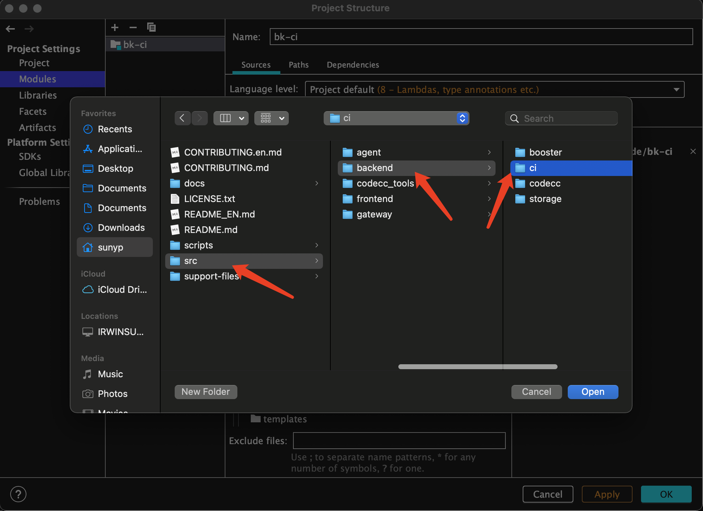
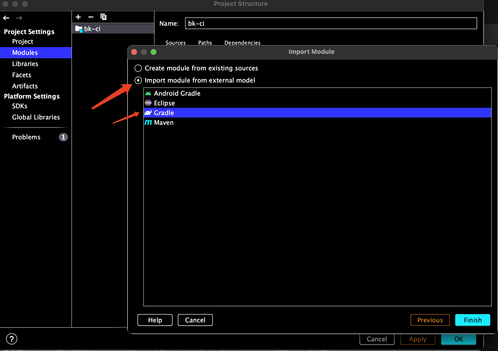
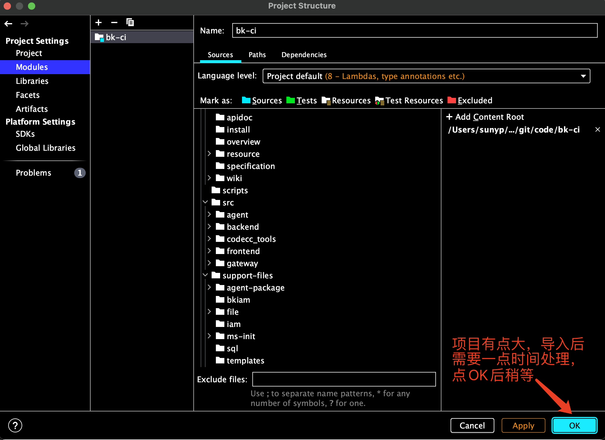
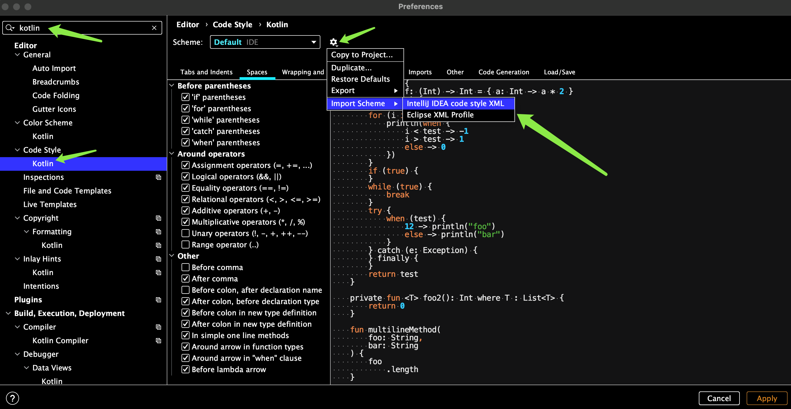
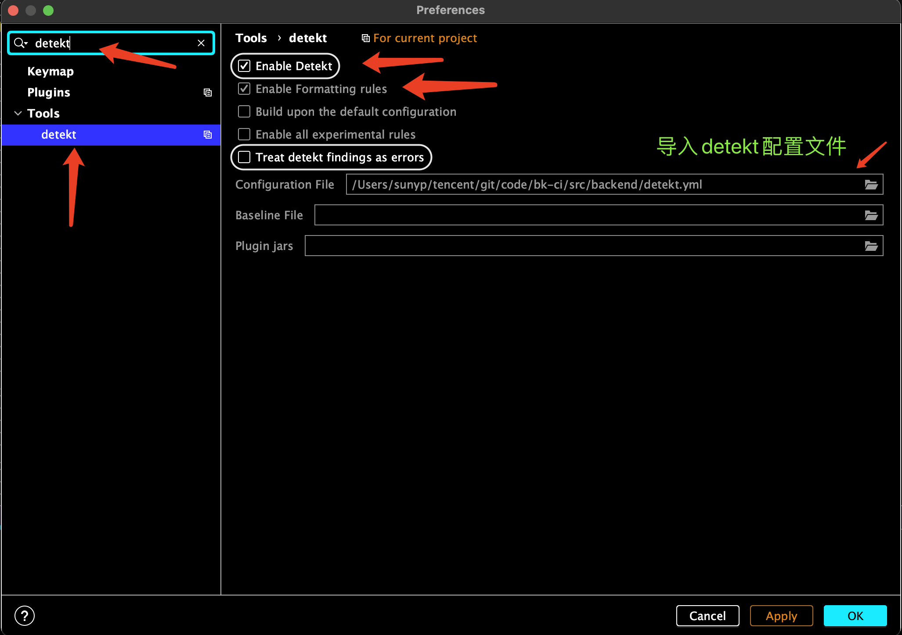
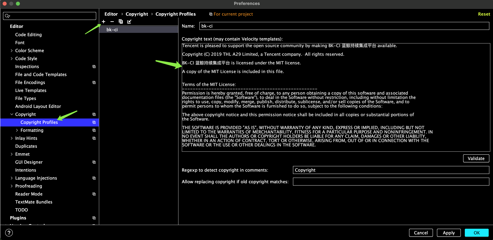
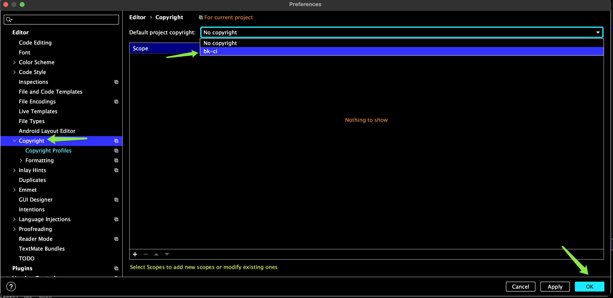

# BK-CI 后台开发指南

BK-CI后台主要技术栈

- 开发平台：Open JDK 8 / Oracle JDK 8
- 开发语言：Kotlin
- 基础框架：Spring全家桶 （SpringBoot1.5+，后续会升级2.X版本）
- 数据库及存储：MySQL 5.7、Redis 2.8、ElasticSearch 7.0+、 RabbitMQ 3.7～3.8
- 服务注册中心：Consul 1.0+ （调试可直接用Server+Agent方式运行）
- 构建工具：Gradle 4.8 ~ 4.10 （后续会升级6.X），可直接使用项目中自带的gradlew/gradlew.bat脚本已经设置好版本
- 代码检查工具：detekt
- 开发工具：Intellij IDEA


## 1. 代码结构介绍
```
|- bk-ci
  |- docs          # 说明文档
  |- scripts       # 部署脚手架脚本
  |- src           # 源代码
    |- agent       # agent源码(golang)
    |- backend     # 后台微服务及构建worker代码(kotlin)
    |- frontend    # 前端源码(vue)
    |- gateway     # 网关源码(lua及配置)
  |- support-files # 部署配置模板文件目录，用于生成分发包时随机附带的配置模板
```

### 1.1 工程源代码(src)

工程是混合了vue/lua/kotlin/java/go/shell 等几种语言，按分层逻辑分网关、前端、后端、Agent、流水线插件等工程

### 1.2 网关工程代码(gateway)

```
|- bk-ci/src
  |- gateway/core
    |- error    # HTTP错误码处理conf配置
    |- static   # 存放各种状态码的HTML标准模板，可替换
    |- lua      # 存放lua脚本
      |- *.lua  # 包含一些lua脚本，主要关注init.lua 脚本，包含了一些重要配置
      |- resty  # 包含resty公用代码，比如MD5，uuid，cookie等开源实现
    |- vhosts
    |- *.conf   # 包含各类conf配置，主要关注server.devops.conf和auth.conf配置文件
```

网关采用OpenResty，其基于Nginx与Lua的高性能Web服务器，通过lua脚本扩展实现对接Consul的微服务路由发现，以及用户鉴权身份认证的对接功能。 

### 1.3 前端代码(frontend)
```
|- bk-ci/src
  |- frontend
    |- devops-atomstore   # 研发商店 Store
    |- devops-codelib     # 代码库管理 Code
    |- devops-environment # 环境管理 Env
    |- devops-pipeline    # 流水线 Pipeline
    |- devops-ticket      # 凭证管理 Ticket
    |- devops-nav         # 顶部菜单导航 Nav
    |- svg-sprites        # 矢量图片资源
      
```
前端基于VUE开发。按服务模块划分目录结构。

### 1.4 后端微服务(kotlin/gradle)&Agent代码(go)

以下对有代表性的服务模块进行展开讲解，其他未说到的是类似的结构。

```
|- bk-ci/src
  |- agent         # agent基于go语言编写，用于在构建机上运行DevopsDaemon&DevopsAgent
  |- backend
		|- boot-assembly            	# 用于构建单体微服务，整合所有微服务的单体jar包，适用于资源紧张场景, build.gradle包含以下core模块业务
		|- core				# core表示核心后台微服务模块代码目录
      |- project                  # BK-CI项目管理微服务
        |- api-project            # api定义抽象层
        |- api-project-sample     # 默认与对接不同平台有差异的部分的api定义抽象层
        |- api-project-blueking   # 对接蓝鲸平台特有差异api定义抽象层
        |- api-project-op         # 运营后台操作类api定义抽象层
        |- biz-project            # api和业务服务实现层，如有一些需要扩展抽象则会放到sample示例实现
        |- biz-project-blueking   # 对接蓝鲸平台的业务服务实现
        |- biz-project-sample     # 业务服务实现扩展示例，主要是示例如何扩展实现
        |- biz-project-op         # 运营后台操作类api的实现
        |- boot-process           # 构建springboot微服务包，设置依赖构建并输出到release目录
        |- model-process          # 使用JOOQ从db中动态生成的PO，表结构有变更需要clean后重新build
      |- auth                  	  # 统一权限控制对接服务

      |- common                   # 通用模块
        |- common-auth            # 权限模块
          |- common-auth-api      # 权限模块的接口抽象
          |- common-auth-provider   # 权限模块提供者
      |- artifactory 							# 对接制品仓库微服务
      |- dispatch    							# 第三方构建机调度,Docker公共构建机调度微服务
      |- dockerhost     					# Docker公共构建机&无编译环境 母机上运行的类似Agent的服务，用于接收构建任务并与Docker进行交互拉起构建任务
      |- environment 							# 构建机环境管理微服务
      |- image                 	  # 与Docker镜像对接的服务
      |- log         							# 构建日志微服务
      |- misc       							# 一些后台同步数据的微服务
      |- notify     							# 对接通知平台微服务
      |- notify     							# 对接通知平台微服务
      |- openapi     							# 开放接口对接微服务：对第三方平台暴露接口的API服务，提供鉴权保护，并转发请求到其他微服务的Service类接口
      |- process     							# 流水线微服务
      |- plugin			 							# 用于给一些插件扩展服务提供后台接口，规划中后续会废弃。
      |- quality									# 质量红线微服务
      |- repository  			  			# 代码仓库微服务
      |- sign       							# APP企业证书签名微服务
      |- store    	   						# 研发商店微服务
      |- ticket     		 					# 凭证微服务
      |- websocket      					# Web通知服务websocket
      |- worker      # 构建机worker（Agent构建任务运行器）
        |- worker-agent   # 构建机中的agent.jar 用于收发构建任务，可gradle依赖引入新增功能
        |- worker-api-sdk # 与后端微服务通信定义的各类api的实现和抽象
        |- worker-common  # agent.jar依赖通用实现和api抽象
        |- worker-plugin-archive # 与构件归档相关的内置任务插件的实现，被引入到agent中
        |- worker-plugin-scm     # 与拉取代码相关实现的内置git任务插件的实现，被引入到agent中
```

## 2 导入bk-ci后台项目

本项目以Intellij IDEA 2020.3.2最新版开发工具为例。

- 从github上 fork 主库（略）

- 在个人开发机上clone你的fork库（略）

- 使用idea用Open Project 方式打开bk-ci代码库（略）
- 进入后可手动导入后台项目：File >> Project Structure  打下以下界面，按如下操作： Mudules >> Import Module


- 选择目录  src/backend/ci  点击 Open 导入



- Select >> Import module from external model  >> Gradle  >> Finish



- 先点击OK生效， 项目有点大，需要一点时间处理。



- 导入完成后再次打开项目结构： 
  - boot-assembly 为单体服务，用于部署环境资源紧张的情况下使用，用于调试亦可，启动稍慢。
  - core 下项目有20+微服务,  各个业务模块的核心代码都在里面。


到此导入后台项目已经完成。接下来需要对开发环境IDE进行一些配置


## 3. 开发工具IDE配置

### 3.1 kotlin code style 编码风格设置

IDEA下的 Kotlin工程代码风格文件见工程：https://github.com/Tencent/bk-ci/blob/master/src/backend/kotlin_code_style.xml

- 导入： **Preferences < Editor < Code Style < Kotlin  点击 Import Schema 选择 Intellij IDEA code style XML** 




### 3.2 detekt 代码规范扫描工具配置

本项目使用detekt插件版本为v1.16.0，相对应的规范配置版本v1.14.2。安装detekt插件查看IDEA官方指导>> https://plugins.jetbrains.com/plugin/10761-detekt 


BK-CI项目是在detekt官方的配置版本v1.14.2之上根据项目业务定制的规范。设置工程开发的detekt的规范配置文件：https://github.com/Tencent/bk-ci/blob/master/src/backend/detekt.yml 

- 导入： **Preferences < Tools < detect**   勾选选择  **Configuration Files**



### 3.3 Copyright 设置

- 创建：**Editor > Copyright > Copyright Profiles** ，点击**+**号新建一个命名为bk-ci(随意起)的profiles， 将 https://github.com/Tencent/bk-ci/blob/master/LICENSE.txt  内容放到Copyright text 框里。



- 回到上一级：**Editor > Copyright** ， 按如图所示操作，使Copyright对项目生效。




## 4. 如何进行后台开发

### 4.1 基本原理（很重要）

以下以Process流水线服务模块进行示例说明：

BK-CI基于Spring框架构建，其Web后台服务是典型的3层结构：web接口层，Service业务层，DAO数据库操作层。接下来罗列一下结构，并重点介绍一个微服务的主要模块划分的原则：

```
|- process                  		# 流水线后台微服务总目录
      |- api-process            # api定义抽象层，提供5类接口
      |- biz-base     					# 公共纯业务代码： DAO操作与Service业务逻辑层， 不依赖其他微服务调用与权限控制代码
      |- biz-engine             # 流水线引擎服务模块
      |- biz-process            # 流水线业务服务模块
      |- biz-process-sample     # 流水线业务服务模块的场景扩展实现示例
      |- boot-process           # 构建springboot微服务包，设置依赖构建并输出到release目录
      |- model-process          # 使用JOOQ从db中动态生成的PO，表结构有变更需要clean后重新build
```

- api-process:  流水线的所有Restful接口定义层以及一些协议pojo对象，但不包含实现代码。其中Restful接口又分为3种类型：
  - User类接口 UserXXXResource：用户态接口，此类接口需要用户登录态，用于Web前端调用，经过网关鉴权得到用户信息后，将用户ID以X-DEVOPS-UID头部传递给User类接口
  - Service类接口 ServiceXXXResource： 用于集群微服务间的调用，目前BK-CI采用FeignClient调用，通过服务发现后拿到该服务接口。
  - Build类接口 BuildXXXResource：构建机构建类接口，由构建机发起，在网关处鉴权构建机的权限再向Build类接口传递。
  - App类接口 AppXXXResource： 手机App态接口，此类接口需要手机端帐号登录后，以手机端的登录态经过网关鉴权解析得到用户信息再向 App类接口传递，目前开源版暂未迁移出蓝盾手机APP版源码，些类接口暂时不会用到。
  - Op类接口 OpXXXResource： Op类接口为OP系统提供运营管理接口，用于提供给OP系统做平台运营时的调整调用，权限控制下放给OP系统和网关控制：鉴权方式一般为网关处+IP白名单 + OP系统实现操作权限控制。 目前开源版未涉及OP系统，此类接口暂时不会用到。

- biz-base： 一般微服务不会有这个模块，因为Process流水线模块比较特殊，存在Web业务服务 + 纯后台引擎服务， 所以抽离出了一个基础模块，biz-base，里面仅包含公共业务逻辑（XXXService）和DB操作（XXXDao）代码，但不包含鉴权逻辑、与其他微服务关联调用等业务场景有绑定关系的代码。
- biz-engine:  流水线后台引擎服务， 依赖于biz-base，只与MQ，DB、Project项目管理基础微服务有交互， 不与其他微服务有调用关系。
- biz-process:  流水线的Web业务服务模块，依赖于biz-base，在上面一层增加鉴权逻辑、其他微服务关联调用等代码，并且仍然会存在一些抽象代码，比如业务对接权限的抽象类，需要自行扩展。
- biz-process-sample:  提供了开源版的示例实现： 1、与权限的对接业务逻辑实现， 2、具体业务场景中的实现。 可以交由社区根据示例自行实现。
- boot-process:  用于管理并构建springboot微服务包，包含了启动类XXXApplication.kt 文件， 与一般的java项目一样，可以根据自己的实现修改build.gradle文件进行定制打包范围，比如开发新增了一个biz-process-xxxx的扩展，可以加入一起打包。
- boot-engine: 预留给大规模场景下，构建出单独的引擎微服务包。 目前默认在build.gradle关闭了该配置，避免微服务规模过大。
- 
