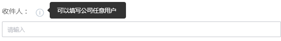
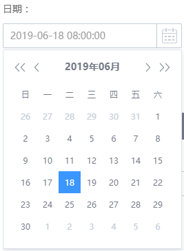

# 配置规范

---

- 输入UI、输出字段和启动命令，由插件开发者定义在插件代码库根目录下名为task.json的文件中
- 文件内容格式为json
- 详细配置说明如下：

```json
{
    "atomCode": "",     # 插件唯一标识，由英文字母组成，与插件初始化时指定的标识一致
    "execution": {      # 执行相关
        "packagePath": "", # 插件执行包路径，插件执行包相对于打的zip包中的位置
        "language": "", # 如python、java等，和插件初始化时指定的语言一致
        "demands": [],  # 执行依赖
        "target": ""    # 执行入口
    },
    "inputGroups": [    # 输入字段分组，影响UI页面展现，可选
        {
            "name": "",         # 英文标识
            "label": "",        # 中文标识
            "isExpanded": true  # 是否默认展开
        }
    ],
    "input": {                 # 插件输入字段定义
        "name":{
            "label": "",       # 中文名，用于展示，允许为空（与其他字段组合的场景）
            "default": "",     # 默认值
            "placeholder": "", # 提示
            "type": "",        # 组件类型
                                单行文本框   (vuex-input)
                                多行文本框   (vuex-textarea)
                                下拉框       (selector)
                                可输入下拉框  (select-input)
                                复选框列表    (atom-checkbox-list)
                                复选框(布尔)  (atom-checkbox)
                                单选          (enum-input)
                                时间选择器    (cron-timer)
                                日期选择      (time-picker)
                                代码编辑框    (atom-ace-editor)
                                人名选择器    (staff-input) 只能添加当前项目成员
                                人名选择器    (company-staff-input) 可以添加公司内任意成员
                                CCAppId      (cc-app-id) 当项目绑定了CCAppId时才有效
            "text": "",               # atom-checkbox组件文本，此时label为空，值为true/false
            "optionsConf": {          # type=selector/select-input组件配置
                "searchable": false,  # 是否可搜索
                "multiple": false,    # 是否为多选
                "url": "",            # 蓝盾服务链接，或者接入蓝鲸网关的API链接
                "paramId": "",        # url返回规范中，用于下拉列表选项key的字段名，配合url使用
                "paramName": ""       # url返回规范中，用于下拉列表选项label的字段名，配合url使用
            },
            "options": [              # type=selector/select-input组件选项列表
                {  
                    "id": "",         # 选项ID
                    "name": "",       # 选项名称
                    "desc": "",       # 选项说明
                    "disabled": false # 是否可选
                }
            ],
            "list": [                 # type=enum-input/atom-checkbox-list组件选项列表
                {
                    "label": "",
                    "value": ""
                }
            ],
            "startDate": 0,           # 时间戳, 毫秒 type=time-picker时生效
            "endDate": 0,             # 时间戳, 毫秒 type=time-picker时生效
            "showTime": false,        # 是否显示时间 type=time-picker时生效
            "groupName": "",          # UI页面上分组展示
            "desc": "",               # 字段说明
            "rely": {                 # 根据条件显示/隐藏当前字段配置
                "operation": "AND",   # 多条件间与/或，可选项： AND/OR
                "expression": [       # 条件list
                    {
                        "key": "",    # 条件字段名
                        "value": Any  # 条件字段值
                    }
                ]
            },
            "required": true,         # 是否必填
            "disabled": false,        # 是否可编辑
            "hidden": false,          # 是否显示
            "isSensitive": false,     # 是否敏感, 敏感信息在日志等地方不展示明文
        }
    },
    "output": {         # 插件输出字段定义
        "outputVar_1": {
            "description": "输出字段说明",
            "type": "", # 输出字段的类型
                          string：字符串，下游插件可以通过${变量名}引用
                          artifact：产出文件，系统将自动归档到仓库，下游插件通过${变量名}引用时，获得仓库中的文件路径列表
                          report: 自定义报告html，系统将自动存储，渲染在产出物报告界面
            "props": {
                "noticeMail": false, # 当type=report时，设置是否需要发送邮件通知
            },
            "isSensitive": false     # 是否敏感，敏感信息在日志等地方不展示明文
        }
    }
}
```

- 若以上配置不满足需求，请联系蓝盾人工客服

## 输入组件配置示例

- vuex-input

    - 配置
    ```
    "fieldName": {
            "label": "版本号",
            "type": "vuex-input",
            "desc": "三级版本号，例：1.0.1",
            "required": true
        }
    ```
    - UI效果

    
    <br/>

- 人名选择器
    - 支持两种场景的组件
        - staff-input： 只能输入当前项目下的成员。输入非项目成员时会报错。
            - 配置
            ```
            "fieldName": {
                "label": "收件人",
                "type": "staff-input",
                "desc": "只能填写当前项目成员"
            }
            ```
            - UI效果

            

        - company-staff-input：可以输入公司内任意成员
            - 配置
            ```
            "fieldName": {
                "label": "收件人",
                "type": "company-staff-input",
                "desc": "可以填写公司任意用户"
            }
            ```
            - UI效果

            
    <br/>

- atom-checkbox

    - 配置
    ```
    "fieldName": {
            "label": "",
            "type": "atom-checkbox",
            "text": "是否需要Rebuild",
            "desc": "XXX"
        }
    ```
    - UI效果

    
    <br/>

- selector/select-input
    - 选项列表在task.json中配置
    ```
    "fieldName":{
        "label": "输入字段名",
        "type": "selector",
        "options":[
            {
                "id":"video",
                "name":"视频"
            },
            {
                "id":"website",
                "name":"网站"
            }
        ]
    }
    ```
    <br/>

    - 选项列表从接口获取
        - 配置规范：
            - 由optionsConf的url、paramId、paramName来指定
            - url支持两类：
                - 蓝盾内置的服务
                - 允许访问的第三方API
            - url返回规范：
                - 返回json格式数据
                    - status：操作是否成功， 0 成功，非0 失败
                    - data：选项列表数据
                        - data中的选项ID和选项名称字段命名不强制，和配置中的paramId、paramName对应即可
                    - message：当status非0时，错误信息
                - 示例：
                ```
                {
                    "status": 0,
                    "data": [
                        {
                            "optionId": "",
                            "optionName": ""
                        }
                    ]
                }
                ```

        - 配置示例
        ```
        "fieldName":{
            "label": "输入字段名",
            "type": "selector",
            "optionsConf": {
                "url": "http://api-test.xxx.com/testnet",
                "paramId": "optionId",
                "paramName": "optionName"
            }
        }
        ```
        <br/>

- atom-checkbox-list
    - 复选框列表
    - 配置示例：
    ```
    "fieldName":{
            "label": "复选框列表",
            "type": "atom-checkbox-list",
            "list": [
                {
                    "id": "php",
                    "name": "php",
                    "disabled": true,
                    "desc": "php是世界上最好的语言"
                },
                {
                    "id": "python",
                    "name": "python",
                    "disabled": false,
                    "desc": "python是世界上最好的语言"
                }
            ]
        }
    ```
    - UI效果
    


- time-picker
    - 日期选择器
    - 配置示例：
    ```
    "fieldName":{
            "label": "日期选择",
            "type": "time-picker",
            "startDate": 1559555765,
            "endDate": 1577894399000,
            "showTime": false
        }
    ```
    - UI效果
    

## 字段根据条件显示/隐藏配置

- 由输入字段定义中的rely属性来指定

- 示例：当字段inputField_1值为true，且inputField_2值为1时显示当前字段，否则隐藏当前字段
```
"fieldName":{
    ...
    "rely": {
        "operation": "AND",
        "expression": [
            {
                "key": "inputField_1",
                "value": true
            },
            {
                "key": "inputField_2",
                "value": 1
            }
        ]
    }
    ...
}

```
