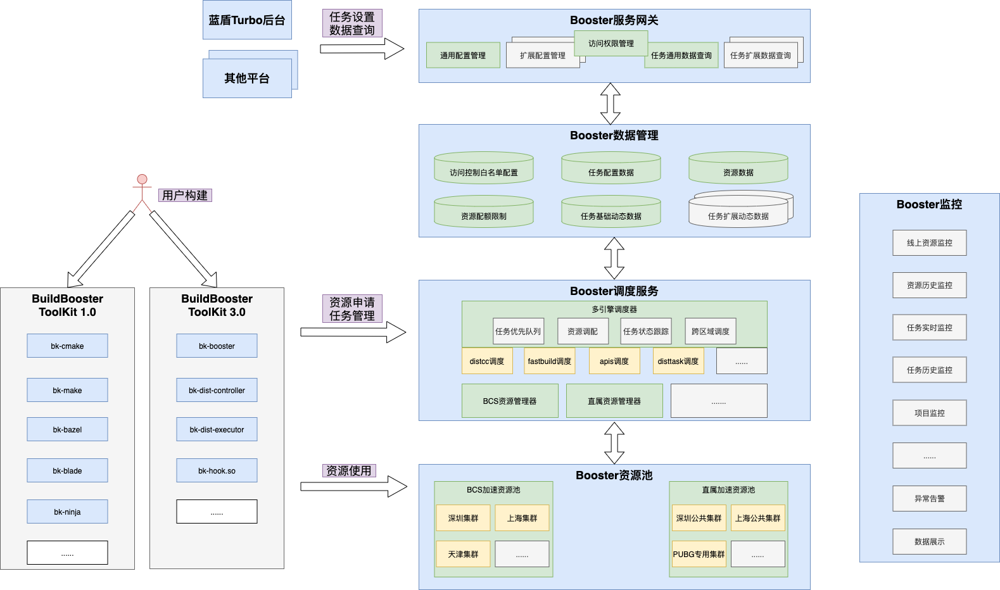
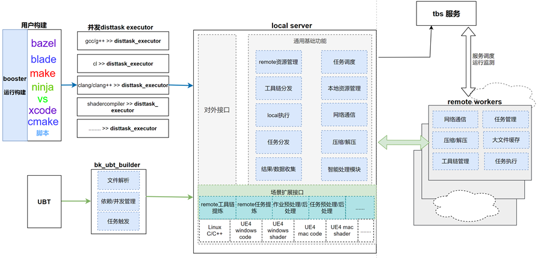

# Task Booster System

编译构建是项目开发和发布过程中的重要环节，同时也是非常耗时的环境，有些项目执行一次完整的构建需要几十分钟甚至几个小时，各种编译构建加速工具都能在一定程度上减小构建时长，为了统一解决服务部署，资源调配，用户接入，系统监控，数据管理等方面的问题，我们实现蓝鲸TBS任务加速平台，统一管理和调度包括distcc，fastbuild等第三方编译构建加速方案，并且实现了跨平台极具场景扩展性的通用分布式任务引擎disttask，支持linux C/C++和UE4等场景编译加速

## Overview
TBS整体架构图如下：

各模块功能说明如下：

1：服务网关
提供服务配置管理的接口，通过这些接口可以完成加速方案的选择和参数设置，项目访问控制等管理功能，服务网关将配置写入数据管理中心并从数据管理中心获取加速任务动态数据。

2：数据管理中心
管理平台的配置数据和构建过程中产生的加速任务状态，统计等数据

3：调度中心
负责distcc，fastbuild，apis，disttask等多种加速引擎和不同资源的调度，根据项目配置和客户端请求，为每次构建调配合适的资源和加速服务，并管理整个构建加速过程的运行和结果收集。
支持快速扩展新的加速引擎和资源管理方案；

4：客户端接入工具包
提供各种构建工具的接入配套工具，方便用户快速从已有构建系统快速接入加速平台；
支持在disttask引擎下快速扩展应用场景下的客户端工具。

5：监控
从业务，资源，任务等各种维度对系统进行运行监控

6：资源池
包括各种主机和容器资源，调度中心根据用户的需求，在这些资源上运行加速服务；
资源池分组管理和调度优先级管理；
支持linux和windows容器调度；
支持linux，windows，macos主机调度；

自研通用分布式加速方案disttask架构：

disttask各模块功能介绍如下：

1： remoter worker
运行在分布式环境中，负责接收，执行和返回分布式任务

2： local server
运行在构建机上，实现分布式任务底层基础功能，并可扩展不同应用场景的分布式任务实现

3： disttask_executor
通用任务执行器，接管实际编译中的编译命令(如 gcc命令，clang命令)，是构建工具和分布式基础服务之间的桥梁

4： 基于disttask提供的接口，根据实际场景需要，实现独立的构建工具

## Features
- 支持通过服务网关接口对加速项目和加速任务进行管理和数据查看
- 支持distcc，fastbuild，apis等多种第三方编译构建加速方案，并支持快速接入新的加速方案
- 支持使用tbs自研disttask引擎扩展实现多种平台的分布式任务，不局限于编译构建任务
- 支持linux，windows平台下容器资源调度
- 支持linux，windows，mac平台主机资源管理
- 支持快速对接不同资源管理平台
- 支持资源分组管理和调配，并支持用户自建资源组加入和使用
- 支持make，cmake，bazel，blade，ninja，vs，ue4，xcodebuild等多种构建工具接入
- 支持修改构建文件和命令的接入方式和系统hook命令方式
- 支持IP,mac地址,业务token等多种访问控制手段
- [disttask]支持linux C/C++编译加速，不受构建工具和构建脚本实现方式限制
- [disttask]支持UE4 linux编译加速
- [disttask]支持UE4 mac代码编译加速
- [disttask]支持UE4 windows代码编译和shader编译加速，跨平台出包等
- [disttask]支持快速扩展各种场景分布式任务加速
- [disttask]构建过程可视化展示

## Getting Started

## Code Structure

## Contributing
对于项目感兴趣，想一起贡献并完善项目请参阅contributing。

## Support
- 参考安装文档
- 阅读源码
- 阅读 wiki 或寻求帮助
- 联系我们

## License