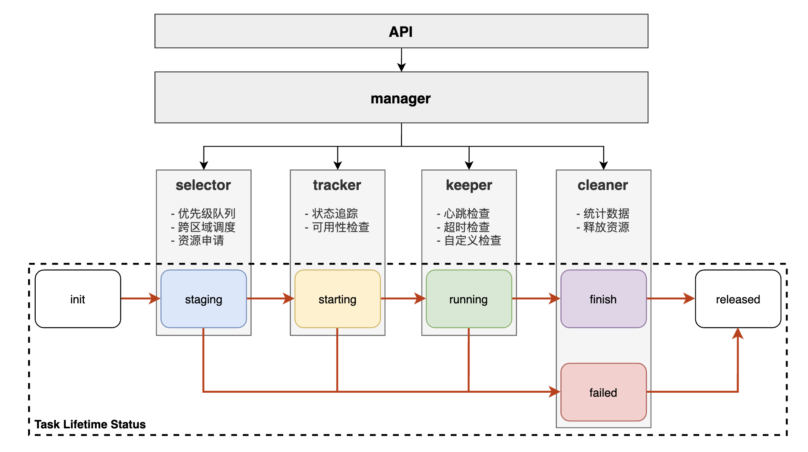
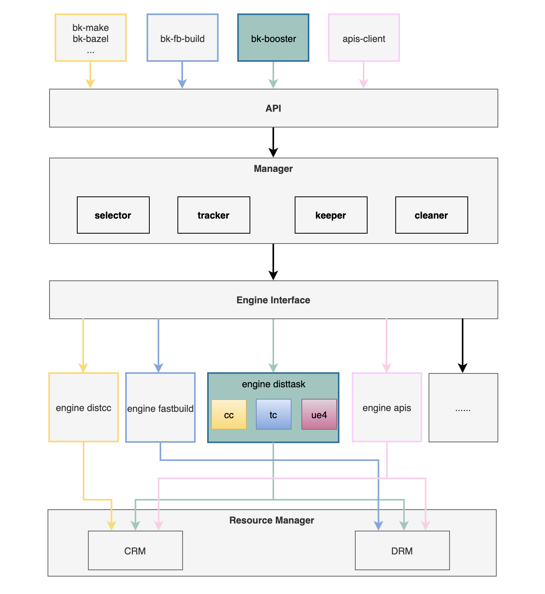
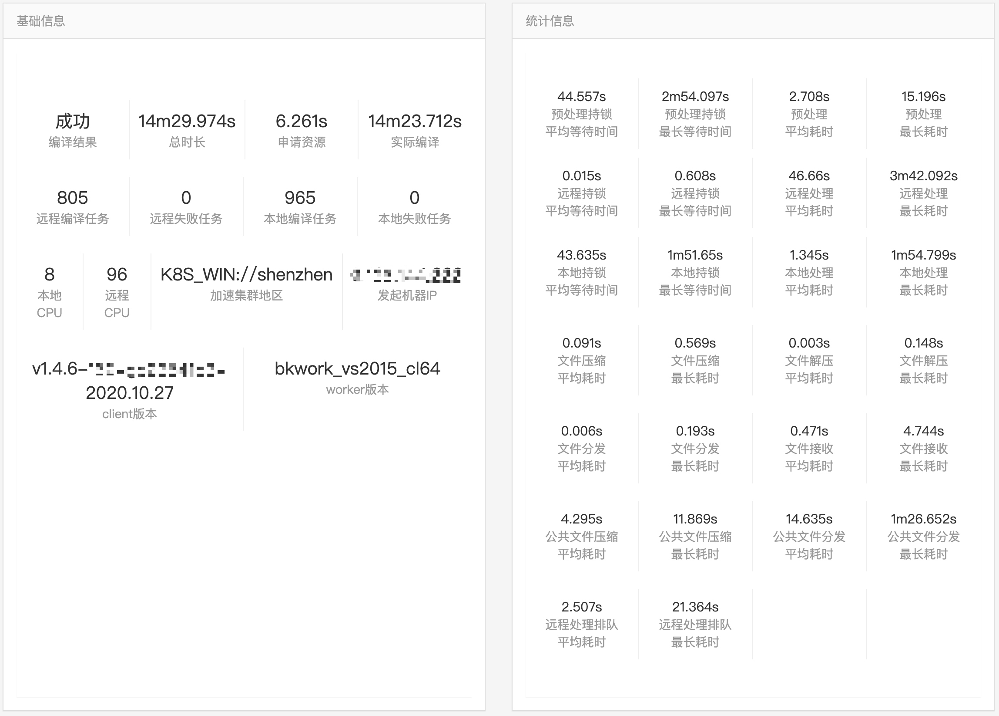
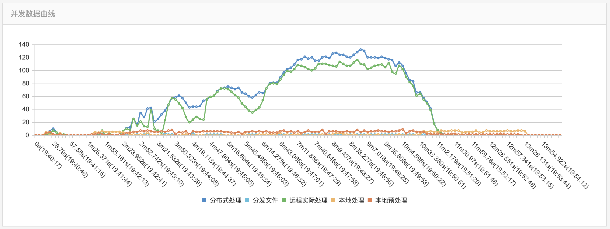
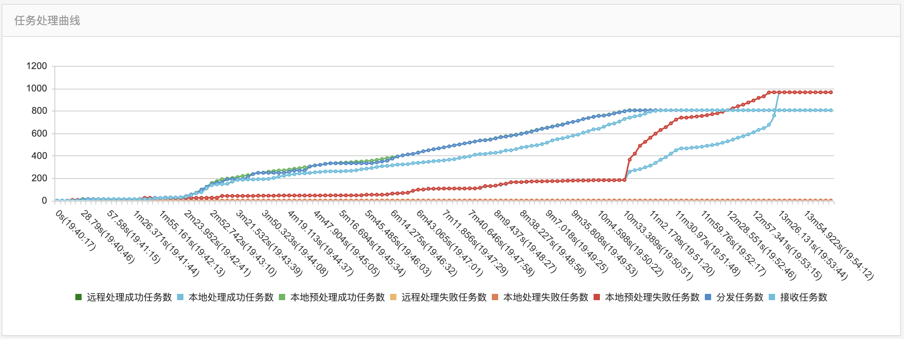
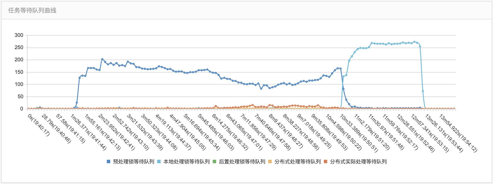

# 分布式编译加速Turbo

Turbo是bk-ci提供的，多场景、多平台的分布式编译加速服务。

### 主要架构

如图所示，主要分为以下几大功能模块：

1. 服务网关
提供服务配置管理的接口，通过这些接口可以完成加速方案的选择和参数设置，项目访问控制等管理功能，服务网关将配置写入数据管理中心并从数据管理中心获取加速任务动态数据。

2. 数据管理中心
管理平台的配置数据和构建过程中产生的加速任务状态，统计等数据

3. 调度中心
负责多种加速引擎和不同资源的调度，根据项目配置和客户端请求，为每次构建调配合适的资源和加速服务，并管理整个构建加速过程的运行和结果收集。

4. 客户端接入工具包
提供各种构建工具的接入配套工具，方便用户快速从已有构建系统快速接入加速平台。

5. 监控
从业务，资源，任务等各种维度对系统进行运行监控

6. 资源池
包括各种主机和容器资源，调度中心根据用户的需求，在这些资源上运行加速服务。资源池分组管理。

### 资源管理器
资源管理器主要分为容器资源管理器和直属资源管理器。

#### 容器资源管理器
容器资源管理（container resource management，crm）基于[BK-BCS](https://github.com/Tencent/bk-bcs) ，实现了资源的容器化分配调度。

其中，包括linux容器和windows容器，以应对不同场景下的资源需求。

#### 直属资源管理器
一些情况下，上层业务需要使用物理机（如mac机器，或敏感项目的独立集群），可以由直属资源管理器（direct resource management，drm）提供支持。

### 流程框架
系统设计上，上层流程框架统一，为不同场景的任务提供了统一的生命周期管理。

### 多场景引擎
拥有了统一的流程管理框架之后，不同场景任务的业务逻辑由不同的引擎（engine）来实现，在统一的抽象层下实现不同的特性。

### 编译可视化
下图展示了整个编译的数据和过程情况：

