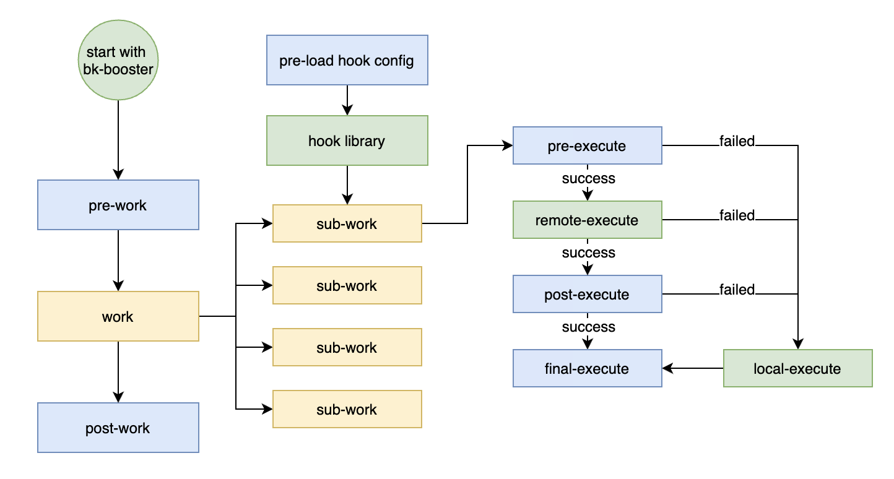
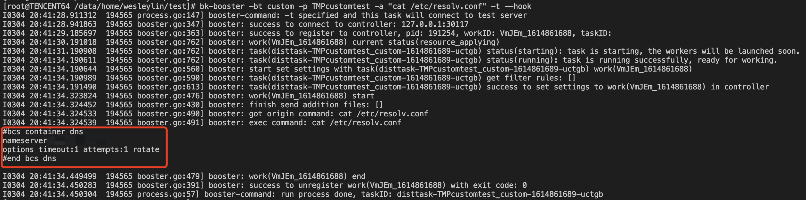

# 自定义handler接入

[TOC]

## 1. 快速入门



如上图所示，是一个**任务**的流程图，其中：

1. ```黄色```部分是一个任务本身的基本过程
   - "work"：任务主体，如make build、bazel build等。
   - "sub-work"：子任务，是分布式加速的直接对象。work通过并发执行多个sub-work来提升处理效率，如make下的gcc、clang等编译命令。
2. ```绿色```部分是tbs提供的功能
   - "start with bk-booster"：提供程序入口，用户可以直接下载工具作为入口执行。
   - "hook library"：提供preload的hook动态库，可以劫持想要的sub-work。
   - "remote-execute"：提供远程分布式资源调配、执行命令、返回结果。
   - "local-execute"：提供错误本地重试、本机资源保护。
3. `蓝色`部分是用户接入handler需要实现的部分，均为**函数**级别的实现
   - "pre-work"：定义在work主体执行前要做的事
   - "post-work"：定义在work主体结束后要收尾的事
   - "pre-load hook config"：定义hook的配置，告诉tbs你要劫持的命令，如gcc、clang
   - "pre-execute"：定义单个sub-work被远程执行前的工作，并给出远程执行需要的信息（依赖文件、命令参数、需要的结果等）
   - "post-execute"：定义单个sub-work远程执行后的工作，并根据remote返回的信息来确定命令的结果
   - "final-execute"：定义单个sub-work最后的收尾工作

>  用户根据实际要扩展的场景，选取下文的**接入方式**之一，完成`蓝色`部分的函数实现，即可实现一个自定义handler接入。


## 2. 接入方式介绍

非侵入性，独立的handler插件。

### 2.1 Golang Plugins

golang提供了以plugin的形式导出函数与类型，当扩展方式是plugin时，tbs将主动获取plugin，并用其提供的接口作为handler操作。

接入时，只需独立编写、构建出plugin，然后与官网下载的对应版本的tbs套件结合使用即可。


## 3. 接入样例

tbs将从环境变量`BK_DIST_CUSTOM_SETTINGS`中获取自定义handler的信息。

其内容应为json格式
```
{
    "type": 1,
    "path": "/etc/bk_dist/custom.so"
}
```

其中`type`是接入的类型

| type | 类型   |
| --- | --- |
| 1 | plugin |
| 2 | shared library |
| 3 | script |
| 4 | API |

### 3.1 Golang Plugins

`plugin/example`包中给出了一个完整的plugin handler接入样例。

样例实现的是一个将本地命令原封不动放到远程执行的handler。

#### 3.1.1 自定义实现

##### 3.1.1.1 pre-work

pre-work接收完整的booster启动指令参数集，在这个场景里我们没有需要实现的。

```golang
func (c *Example) PreWork(dcType.BoosterConfig) error {
	return nil
}
```

##### 3.1.1.2 post-work

post-work同上，在这个场景里没有需要实现的。

```golang
func (c *Example) PostWork(dcType.BoosterConfig) error {
	return nil
}
```

##### 3.1.1.3 pre-load hook config

pre-load hook config负责从默认配置文件`bk_custom_example_rules.json`中读取hook信息，并返回hook配置。

```golang
const (
	hookConfigPath = "bk_custom_example_rules.json"
)

func (c *Example) GetPreloadConfig(dcType.BoosterConfig) (*dcSDK.PreloadConfig, error) {
	return getPreloadConfig(dcConfig.GetFile(hookConfigPath))
}

func getPreloadConfig(configPath string) (*dcSDK.PreloadConfig, error) {
	f, err := os.Open(configPath)
	if err != nil {
		return nil, err
	}
	defer func() {
		_ = f.Close()
	}()

	var pConfig dcSDK.PreloadConfig
	if err = codec.DecJSONReader(f, &pConfig); err != nil {
		return nil, err
	}

	return &pConfig, nil
}

```

##### 3.1.1.4 pre-execute

pre-execute获得sub-work的命令行参数，并决定如何在远程执行

```golang
func (c *Example) PreExecute(command []string) (*dcSDK.BKDistCommand, error) {
	if len(command) < 1 {
		return nil, fmt.Errorf("invalid command and pararms")
	}

	return &dcSDK.BKDistCommand{
		Commands: []dcSDK.BKCommand{{
			ExeName: command[0],
			Params:  command[1:],
		}},
	}, nil
}
```

在这个场景里，我们原封不动地将命令组装起来即可，不需要额外发送、接收文件，远程的标准输出/标准错误会直接返回到本地。

##### 3.1.1.5 post-execute

post-execute获得sub-work在远程执行的结果，并决定最终的结果。在这个场景中，只要远程的执行返回码为0，我们就认为成功了。

```golang
func (c *Example) PostExecute(result *dcSDK.BKDistResult) error {
	if result != nil && len(result.Results) > 0 && result.Results[0].RetCode == 0 {
		return nil
	}

	return fmt.Errorf("remote execute error")
}
```

##### 3.1.1.6 final-execute

final-execute在这个场景中无需做什么。

```
func (c *Example) FinalExecute([]string) {
}
```


#### 3.1.2 使用

可以采用以下命令编译

`CGO_ENABLED=1 go build -buildmode=plugin -o custom-plugin.so ./example/example.go`

并获取plugin handler：`custom-plugin.so`

使用时，将`custom-plugin.so`放在`/etc/bk_dist/custom.so`

指定custom信息

```
export BK_DIST_CUSTOM_SETTINGS="{\"type\": 1, \"path\":\"/etc/bk_dist/custom-plugin.so\"}"
```

同时写入hook配置`/etc/bk_dist/bk_custom_example_rules.json`

```
{
    "hooks":[
        {"src_command":"cat","target_command":"/usr/local/bin/bk-dist-executor $SRC_CMD"}
    ]
}
```

这样就能够hook住脚本中的`cat`命令，然后下载对应版本的`tbs`工具套件，执行bk-booster，指定`-bt`(booster type)为`custom`

```
bk-booster -bt custom -p TMPcustomtest -a "cat /etc/resolv.conf" -t --hook
```

即可实现一个cat远程机器文件的自定义任务。

